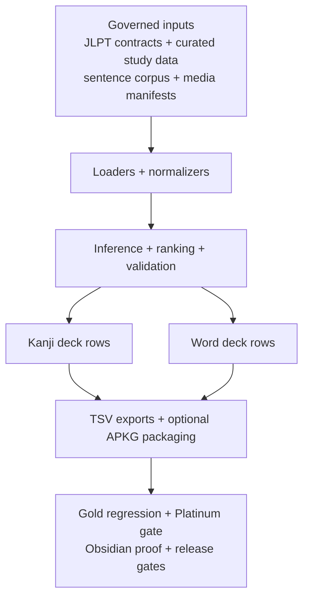
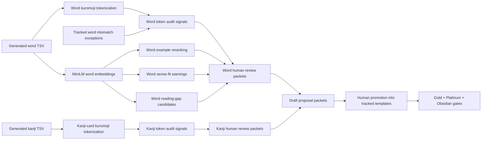

# Japanese Kanji Anki Builder

Japanese Kanji Anki Builder creates governed Anki flashcard decks for JLPT kanji and vocabulary. It combines curated study data, example sentences, pronunciation audio, stroke-order media, pitch-accent information, and tracked review contracts into deterministic TSV exports and optional `.apkg` packages.

Run this first:

```bash
npm run doctor
```

Kanji cards and word cards are separate learning products. A kanji card teaches one target kanji. A word card teaches one exact written form and reading, such as `学校|がっこう`.

## About

This repository is built for controlled output, not casual scrape-and-export deck generation.

- Tracked JSON contracts define JLPT kanji inventory, word eligibility, Anki note fields, media policy, review expectations, and source-evidence rules.
- Ignored local files under `data/`, `downloads/`, and `out/` are workspace inputs or generated artifacts. They are not product truth unless promoted into tracked contracts.
- Gold regression, Platinum structural gates, Obsidian rereview proof, source-governance audits, and release QA are separate checks. A pass in one layer does not imply a pass in the others.
- Build scripts produce deterministic TSV exports and byte-stable optional `.apkg` packages from unchanged packaged inputs.

## Scope

- JLPT kanji decks from N5 through N1.
- JLPT word decks by exact written form and reading.
- Curated learner-facing readings, meanings, examples, notes, pitch accent, audio, and stroke-order media.
- Governed source evidence for JLPT kanji taxonomy and word-card field review.
- Offline-safe preview, review, build, package, audit, and release-gate commands.

## Quick Start

```bash
npm install
npm run doctor
npm run corpus:init
npm run curated:init
npm run words:init
npm run media:init
npm run deck:ready -- --levels=5
npm run deck:words:ready -- --levels=5
```

Kanji deck readiness requires governed audio and complete exported media fields. A level with missing exact primary-reading audio must not be treated as ready even if the managed manifest inventory reports audio coverage.

Native `.apkg` commands require the Python packaging toolchain. If packaging is blocked on a workstation, use the readiness output and package directory for review, then run `.apkg` packaging in a supported environment before release.

## Security Posture

This repository is a local deck-build tool, not a hosted public service. The Express server has no authentication layer and is intended for local development only. It binds to `127.0.0.1` by default. Set `SERVER_HOST=0.0.0.0` only for a deliberate, temporary, trusted-network workflow.

VOICEVOX should also stay local. The governed Docker helper expects host `127.0.0.1:50021` mapped to Nemo container port `50121` and recreates stale containers that are missing the required runtime hardening: `no-new-privileges`, `cap-drop ALL` with only `SETUID` and `SETGID` restored for the image entrypoint's `gosu` user switch, `--restart no`, Docker `--init`, and explicit memory, CPU, and process-count limits.

Treat ignored workspace inputs under `data/`, `downloads/`, and `out/` as local, review-required material. Do not import untrusted dictionaries, sentence corpora, media, or audio without checking the parser/import path and resulting card surfaces.

See [SECURITY.md](SECURITY.md) for the disclosure policy and threat model. See [docs/supply-chain-security.md](docs/supply-chain-security.md) for dependency, workflow, script, and release-artifact trust boundaries.

Security CI includes dependency review, npm advisory auditing, tracked secret scanning, lockfile-derived CycloneDX SBOM validation, branch-protection policy checks, requirements traceability, hostile-input regression tests, and pinned CodeQL analysis for JavaScript/TypeScript plus GitHub Actions workflow code.

Tagged release bundles include a checksum manifest, generated CycloneDX SBOM, and GitHub artifact attestations for provenance and SBOM binding.

## Review Tiers

These tier names are product gates, not marketing labels. Kanji and word decks run them separately.

The binding operating contract for Platinum and Obsidian work is [docs/platinum-obsidian-review-contract.md](docs/platinum-obsidian-review-contract.md). Read it before any Platinum or Obsidian batch.

| Tier | What it means | What it does not prove |
| --- | --- | --- |
| Silver | A generated card surface exists for the product. | Reviewed content, source truth, release quality, or learner usefulness. |
| Gold | Gold regression protects reviewed generated output from drift. | Source truth, release approval, or substantive current-version rereview. |
| Platinum | The card passes the current product's card-quality Platinum gate against live generated rows. Evidence lanes are separated into governed source truth, internal checks, and reviewer judgment. | Obsidian proof, native-level language judgment, or permission to shrink the square-zero certification denominator. |
| Obsidian | Explicit non-mechanical current-version rereview proof exists for the live card. Kanji proof must include structured rereview provenance and actual example-sentence review evidence. Word proof must include structured rereview provenance, exact word-reading identity binding, a full word-card evidence checklist, and actual example-sentence review evidence. | A later fluent/native audit unless that provenance is separately recorded. |

## Current Baseline

Run live commands for release decisions. This section is an orientation snapshot, not the release gate. Commits that change review counts, proof posture, or readiness posture must update the affected README, docs, and changelog lines in the same commit.

All five JLPT levels are first-class product surfaces. N5/N4/N3/N2 kanji are Obsidian certified; N1 is currently a trusted-reset lane with fresh governed Platinum batching restarted and no Obsidian certification counted.

### Kanji Product

| Surface | Current state | Main gates |
| --- | --- | --- |
| N5 kanji | `80/80` generated, Gold, Platinum, and Obsidian. | `deck:platinum:n5`, `deck:kanji:obsidian:certify-status -- --levels=5`, `deck:ready -- --levels=5` |
| N4 kanji | `212/212` generated, Gold, Platinum, and Obsidian. | `deck:platinum:n4`, `deck:kanji:obsidian:rereview-status -- --levels=5,4`, `deck:ready -- --levels=4` |
| N3 kanji | `341/341` generated, Gold, current-standard card-quality Platinum, and Obsidian certified. | `deck:kanji:review-status`, `deck:ready -- --levels=3`, `deck:platinum:n3`, `deck:kanji:obsidian:rereview-status -- --levels=3`, `deck:kanji:obsidian:certify-status -- --levels=3` |
| N2 kanji | `349/349` generated, Gold, current-standard card-quality Platinum, and Obsidian certified with `0` remaining and `0` blocked/failing. | `deck:kanji:review-status`, `deck:platinum:n2`, `deck:ready -- --levels=2`, `deck:kanji:obsidian:rereview-status -- --levels=2`, `deck:kanji:obsidian:certify-status -- --levels=2` |
| N1 kanji | `1230/1230` generated and Gold; trusted current-standard card-quality Platinum is `256/1230`, trusted Obsidian proof remains reset to `0/1230`, and `974` generated rows still require fresh actual card-data Platinum review before any Obsidian proof is recorded. | `deck:kanji:review-status`, `deck:ready -- --levels=1`, `deck:platinum:n1`, `deck:platinum:batch -- --level=1 --limit=8 --queue=missing-current-standard` |
| Additional kanji diagnostic | `0` physical additional cards. `398` additional source claims are governed and suppressed because they collide with `387` core-retained source-claim kanji; unresolved duplicates are `0`. | `deck:kanji:additional:ready`, `deck:kanji:review-status` |

`deck:ready` currently reports N5 through N1 kanji as ready with `100.0%` of mechanical readiness checks passing for sentence, curated, stroke-order, required media, readings, meanings, examples, and contextual notes. For N1, this is not content trust, Platinum coverage, Obsidian certification, or release approval.

Full-level media completeness is owned by `deck:ready -- --levels=<level>` plus the media policy audits. `media:review:audio` is only scoped card-level audio identity/listening evidence for the cards under review; it must never be reported as full-level media coverage or used to shrink the media denominator.

Kanji Platinum uses `kanji-platinum-v3-evidence-lanes`. Only current-standard `platinum` and `fixed_then_platinum` entries count as active Platinum after actual card-data review. Legacy or unversioned history is non-certifying backlog until revalidated under the current standard.

`deck:kanji:obsidian:rereview-status -- --levels=5,4,3,2` currently reports N5/N4/N3/N2 kanji as `982/982` Platinum, `982/982` Obsidian, `0/982` needing Obsidian, and `0/982` blocked/failing.

`deck:kanji:obsidian:certify-status -- --levels=5,4,3,2` is the fail-closed kanji Obsidian gate for the completed N5/N4/N3/N2 denominator and currently passes.

For scoped canonical kanji proof levels (N5/N4/N3/N2), switched kanji proof consumers read canonical JSONL Obsidian proof from `templates/obsidian_proof_ledger/*.jsonl`; tracked review-set JSON no longer carries inline Obsidian proof objects for those levels. Kanji levels without scoped proof ledgers still fall back through the provider path until their own proof ledgers are deliberately created and gated.

### Word Product

| Surface | Current state | Main gates |
| --- | --- | --- |
| N5 word | `287` canonical rows plus `20` source-only phrase exclusions. Gold, readiness, tracked-source artifact, Platinum, and strict word Obsidian proof pass at `287/287`. Manual import QA, accessibility, and listening checks are still required before release-ready product claims. | `deck:words:platinum:n5`, `deck:words:obsidian:rereview-status -- --levels=5,4`, `deck:words:obsidian:certify-status -- --levels=5` |
| N4 word | `700` canonical rows. The generated card surface builds at `700/700` with word audio, pitch, required back-side fields, examples, reading breakdowns, support labels, Gold, Platinum, and strict Obsidian proof complete. Live readiness is `ready_with_deferred_variants`; reading coverage is `76.7%` (`579/755`). Manual import QA, accessibility, and listening checks are still required before release-ready product claims. | `deck:words:ready -- --levels=5,4`, `deck:words:review:n4`, `deck:words:platinum:n4`, `deck:words:obsidian:certify-status -- --levels=4` |
| N3 word | `269` canonical Silver rows build at `269/269`; single-level readiness is incomplete; cumulative reading coverage is `19.1%` (`235/1232`). Gold, Platinum, and Obsidian are not started. | `deck:words:ready -- --levels=3`, `deck:words:completion:n3`, `deck:words:reading-audit:n3` |
| N2 word | `28` canonical Silver rows build at `28/28`; single-level readiness is incomplete; cumulative reading coverage is `4.6%` (`49/1061`). Gold, Platinum, and Obsidian are not started. | `deck:words:ready -- --levels=2`, `deck:words:completion:n2`, `deck:words:reading-audit:n2` |
| N1 word | `26` canonical Silver rows build at `26/26`; single-level readiness is incomplete; cumulative reading coverage is `1.2%` (`41/3284`). Gold, Platinum, and Obsidian are not started. | `deck:words:ready -- --levels=1`, `deck:words:completion:n1`, `deck:words:reading-audit:n1` |

Word Platinum uses `word-platinum-v3-evidence-lanes`. Current N5/N4 generated word denominator is `987` rows. Card-quality Platinum is `987/987`, strict Obsidian proof is `987/987`, `0` Platinum entries need Obsidian, and `0` generated N5/N4 word rows are blocked/failing current-standard Platinum.

For migrated N5/N4 word proof, the word Obsidian status/certification commands and their older Platinum compatibility aliases read scoped canonical JSONL Obsidian proof from `templates/obsidian_proof_ledger/word_n5.jsonl` and `templates/obsidian_proof_ledger/word_n4.jsonl` through the proof-provider path by default. The tracked N5/N4 word review sets no longer carry inline word `rereviewProvenance`; reconciliation binds the canonical ledger proof back to those tracked entries.

`deck:words:platinum:source-posture -- --levels=5,4` currently inspects `987` structurally current-standard entries: `121/987` have independent source families proven, `866/987` are single-source-family, and `0/987` are missing governed source evidence.

Single-source entries carry `word_source_independence_not_proven`. Source-family posture is a diagnostic. It is not the rereview selection pool and not substantive Platinum proof.

### Cross-Product Gates

- `deck:words:obsidian:rereview-status -- --levels=5,4` uses generated word rows as the denominator and defaults to canonical JSONL proof for migrated N5/N4 word ledgers. N5 word `287/287` and N4 word `700/700` Obsidian remain separate from `987/987` card-quality Platinum.
- `deck:words:obsidian:certify-status -- --levels=5,4` is the fail-closed word Obsidian gate. It currently passes for the full N5/N4 word square-zero certification denominator.
- `deck:platinum:governance-gate` exercises real generated N5/N4 kanji and word rows when ignored local inputs are present. It currently passes with governance warnings for word single-source-family posture, bulk-template or missing card-specific revalidation summaries, marker-only example-quality automation, and zero active verification limitations. Migrated kanji and word Obsidian proof inputs read through the scoped proof-provider path.
- JLPT kanji source evidence is governed separately from deck readiness. The source audit currently passes source-use governance with `--governance-strict` while evidence-depth work remains incomplete.

## Pipeline At A Glance

Tracked inputs are normalized, ranked, validated, reviewed, and exported into separate kanji and word products. Generated rows, review proof, package artifacts, and release claims are intentionally separate.



## Deck Model At A Glance

Kanji decks teach one kanji at a time. The front of a kanji card is only the target kanji. The back teaches that kanji's primary learner-facing reading and meaning, then uses words and sentences as support.

Word decks teach vocabulary by exact written form and reading. A useful word can appear even if it contains harder kanji, but the card must label those kanji instead of pretending they belong to the current level.

Detailed field contracts, sample cards, and TSV examples live in [docs/deck-model.md](docs/deck-model.md). Card curation rules live in [docs/content-style-guide.md](docs/content-style-guide.md).

## Source Of Truth

Tracked contracts define release behavior:

| Area | Primary tracked source |
| --- | --- |
| JLPT kanji taxonomy | [templates/jlpt_level_contract.json](templates/jlpt_level_contract.json) |
| JLPT kanji source evidence | [templates/jlpt_kanji_source_evidence.json](templates/jlpt_kanji_source_evidence.json), [templates/jlpt_kanji_source_evidence/assignments](templates/jlpt_kanji_source_evidence/assignments) |
| JLPT kanji source acquisition | [docs/source-acquisition-register.md](docs/source-acquisition-register.md) |
| JLPT kanji source-input preflight | [templates/jlpt_kanji_source_inputs.json](templates/jlpt_kanji_source_inputs.json) |
| Kanji reading reference | [templates/kanji_reading_reference_contract.json](templates/kanji_reading_reference_contract.json) |
| Kanji card field source contracts | [templates/kanji_card_field_source_contract.json](templates/kanji_card_field_source_contract.json), [templates/kanji_card_field_source_contracts](templates/kanji_card_field_source_contracts) |
| JLPT word taxonomy | [templates/jlpt_word_level_contract.json](templates/jlpt_word_level_contract.json) |
| Audio source policy | [templates/audio_source_policy.json](templates/audio_source_policy.json) |
| Kanji note schema | [src/config/ankiNoteSchema.json](src/config/ankiNoteSchema.json) |
| Word note schema | [src/config/ankiWordNoteSchema.json](src/config/ankiWordNoteSchema.json) |
| Gold kanji regression sets | `templates/golden_n*_review_set.json` |
| Gold word regression sets | [templates/golden_n5_word_review_set.json](templates/golden_n5_word_review_set.json), [templates/golden_n4_word_review_set.json](templates/golden_n4_word_review_set.json) |
| Platinum and Obsidian review contract | [docs/platinum-obsidian-review-contract.md](docs/platinum-obsidian-review-contract.md) |
| Platinum policy | [docs/platinum-review-policy.md](docs/platinum-review-policy.md) |
| Platinum kanji review sets | `templates/platinum_n*_review_set.json` |
| Platinum word review sets | [templates/platinum_n5_word_review_set.json](templates/platinum_n5_word_review_set.json), [templates/platinum_n4_word_review_set.json](templates/platinum_n4_word_review_set.json) |
| Platinum card-source roles | [templates/platinum_card_source_manifest.json](templates/platinum_card_source_manifest.json) |
| Word source manifest | [templates/word_source_manifest.json](templates/word_source_manifest.json) |
| Word expansion signal config | [templates/word_expansion_signal_sources.json](templates/word_expansion_signal_sources.json) |
| Assistive NLP model/runtime manifest | [templates/nlp_model_manifest.json](templates/nlp_model_manifest.json) |
| Assistive NLP tokenizer exceptions | [templates/nlp_word_tokenization_mismatch_exceptions.json](templates/nlp_word_tokenization_mismatch_exceptions.json) |

Word source lanes currently include active ignored-local JMdict dictionary verification plus JMdict priority/commonness support. `jpdb-frequency` remains blocked pending permission/governed export.

## JLPT Kanji Source Evidence At A Glance

The source-evidence manifest is the governed source registry: [templates/jlpt_kanji_source_evidence.json](templates/jlpt_kanji_source_evidence.json). The current JLPT kanji contract is an operational comparator, not final source truth, and no source lane can move kanji, move words, update decks, or change readiness by itself.

Reviewer evidence is loaded as source-centric `assignments[sourceId][kanji]` rows and stored in routed per-source assignment files. The materialized `kanji` rollup is derived summary state. It intentionally keeps only level/review-status facts plus computed consensus, agreement, confidence, and notes so reviewer citations are not duplicated across the manifest.

Manifest status is a lifecycle gate. `planned` means registered but not active, `in_review` means manual review or source-input preparation is underway, `active` means the lane may be imported and counted according to governed use, and `blocked` means it must not enter consensus.

| Source lane | Source / location | Current use |
| --- | --- | --- |
| `current_operational_contract` | [Tracked JLPT kanji contract](templates/jlpt_level_contract.json) | Active non-voting comparator for the current operational taxonomy |
| `tanos_legacy_direct` | [Tanos JLPT direct legacy resources](https://www.tanos.co.uk/jlpt/sharing/) | Active approved bulk-import assignment evidence for direct legacy N1, N4, and N5 mappings |
| `tanos_estimated_split` | [Tanos estimated N2/N3 resources](https://www.tanos.co.uk/jlpt/sharing/) | Active approved lower-weight assignment evidence for estimated N2/N3 splits; cannot settle taxonomy movement alone |
| `tanos_frequency_method_notes` | [Tanos sharing/method notes](https://www.tanos.co.uk/jlpt/sharing/) | Active non-voting methodology lane explaining why Tanos N2/N3 evidence is estimated |
| `kanjidic2_legacy` | [KANJIDIC2 legacy JLPT metadata](https://www.edrdg.org/wiki/KANJIDIC_Project.html) | Active approved bulk-import assignment evidence; current pinned rows are exact N1/N4/N5 only, with old JLPT 2 preserved as N2/N3 range evidence when present |
| `official_jlpt_sample_workbooks` | [Official JLPT sample questions/workbooks](https://www.jlpt.jp/e/samples/sampleindex.html?mode=pc-5) | Active occurrence-only evidence; stores only source PDF, section/page/question reference, and observed kanji |
| `japanese_textbook_consensus` | Derived from individual textbook lanes in the source manifest | Active non-voting derived summary; never manually imported as a copied list |
| `ask_hajimete_jlpt_kanji` | [ASK Hajimete JLPT kanji books](https://ask-books.com/series/jlpt-kanji/) | Active restricted manual-citation textbook lane with `208` reviewed assignments, `0` source_access_gap rows, and `0` pending rows; N4 remains unsupported until exact assignment proof is verified |
| `jlptsensei` | [JLPT Sensei kanji lists](https://jlptsensei.com/) | Planned secondary non-Japanese manual-citation signal; inactive/non-voting until reviewed rows are pinned and source activated; do not scrape, copy, or republish lists |
| `shin_kanzen_master_kanji` | [Shin Kanzen Master textbooks](https://www.3anet.co.jp/np/en/list.html?series_id=4) | Active restricted manual-citation assignment lane with `406` reviewed assignments, `236` source_access_gap rows, and `1570` pending rows |
| `nihongo_sou_matome_kanji` | [Nihongo Sou Matome textbooks](https://www.ask-books.com/jp/somatome/) | Active restricted manual-citation textbook lane with `442` reviewed assignments, `473` source_access_gap rows, and `1297` pending rows; pause broad review until fuller exact assignment access or targeted citations are available |
| `try_jlpt_textbook` | [TRY! JLPT textbooks](https://ask-books.com/jlpt-try) | Blocked unless exact per-kanji assignment proof is found; public TRY materials expose grammar/vocabulary surfaces, not exact per-kanji assignment proof |
| `joyo_grade` | [Agency for Cultural Affairs Joyo kanji index](https://www.bunka.go.jp/seisaku/kokugo_nihongo/kokugo_shisaku/joyokanjihyo_sakuin/index.html) | Planned official background metadata only; not JLPT assignment proof |
| `bccwj_frequency` | [BCCWJ frequency lists](https://clrd.ninjal.ac.jp/bccwj/en/freq-list.html) | Planned frequency sanity only; not assignment truth |
| `kanji_alive` | [Kanji Alive credits/data policy](https://kanjialive.com/credits/) | Planned learner/background metadata only; not JLPT assignment proof |
| `jpdb` | [jpdb kanji metadata](https://jpdb.io/) | Planned restricted manual frequency sanity only after source-use review; no automated extraction, raw data storage, assignment truth, or consensus voting |
| `kanshudo` | [Kanshudo terms](https://www.kanshudo.com/tc) | Planned restricted lane; blocked until express permission/license and a governed use path are approved |
| `wanikani` | [WaniKani terms](https://www.wanikani.com/terms) | Planned restricted lane; blocked until source-use/API/export terms and a governed use path are approved |

Tanos direct legacy and KANJIDIC2 legacy have different publisher-independence groups but share the `pre_2010_direct_jlpt` evidence lineage. They do not satisfy the independent-lineage requirement by themselves.

## Product Rules

Kanji decks:

- Each shipped kanji belongs to the tracked JLPT kanji contract.
- The JLPT kanji contract is the current operational taxonomy, not sole source truth.
- Non-disputed source consensus can be promoted only by an explicit governed contract migration.
- The kanji deck learning target is the individual kanji.
- `DisplayWord` is the target kanji itself.
- `PrimaryReading` is the most learner-useful, level-appropriate reading for that kanji.
- Compound words belong in notes, examples, and word decks; they must not replace the kanji-card anchor.
- Audio is governed by policy and required for kanji deck readiness.
- Additional kanji is currently a source-claim diagnostic with `0` physical cards, not an extra learner backlog.

Word decks:

- Word identity is `written|reading`.
- The canonical word contract means default-deck eligible.
- Source-only phrase exclusions stay tracked but do not ship as default word cards.
- A word is anchored by kanji from its own deck level. Other constituent kanji are support kanji and must be visibly labeled.
- A word must not ship in an easier/higher-numbered deck when it has no current-level anchor and depends only on harder support kanji.
- Outside-JLPT constituent kanji do not choose the JLPT deck level, but they must be visibly labeled.
- Reading coverage is scoped to the selected word-product levels.
- Expansion triage is routing only. A word moves only when the target level's word contract and starter data are updated and pass that level's gates.
- Sentence orthography review is advisory. It flags likely kana-only regressions without banning natural kana usage.

Review layers:

- Gold regression protects reviewed generated output from drift. It does not mean release approval.
- Platinum gates current card-quality requirements against live generated rows.
- Platinum requires field-bound source evidence, explicit quality gates, and a keep/fix/defer/remove decision.
- Obsidian certification requires explicit non-mechanical current-version rereview proof.
- Platinum manifests are in progress. Only active `platinum` and `fixed_then_platinum` entries can count as reviewed release coverage.
- Kanji Platinum entries before `kanji-platinum-v3-evidence-lanes`, and word Platinum entries before `word-platinum-v3-evidence-lanes`, are legacy history until revalidated.
- Use the [Obsidian batch workflow](docs/obsidian-batch-workflow.md) for review batches. Run status, batch, generated-surface refresh, NLP support, human review, canonical JSONL proof append via `data:obsidian:proof:append`, structural/reading verification, and progress checks during the work; run the fail-closed certification gate only when the selected scope is expected to be fully Obsidian.

## Core Workflows

Use [docs/workflows.md](docs/workflows.md) for complete workflow details.

High-value entry points:

```bash
npm run doctor
npm run deck:readiness
npm run deck:ready -- --levels=5
npm run deck:words:ready -- --levels=5,4
npm run deck:kanji:review-status
npm run deck:words:obsidian:rereview-status -- --levels=5,4
npm run deck:words:platinum:source-posture -- --levels=5,4
npm run deck:platinum:governance-gate
```

Media and audio entry points:

```bash
npm run media:plan -- --level=5 --limit=25
npm run media:sync -- --level=5 --limit=25
npm run voicevox:status
npm run voicevox:start
npm run media:voicevox:words -- --level=5 --speaker-id=10005 --concurrency=4
npm run media:review:word-audio -- --level=5 --limit=25
npm run data:audit:audio -- --json
```

## Verification And Release

Use [docs/verification.md](docs/verification.md) for the full verification bundle and gate explanations. Use [docs/release-process.md](docs/release-process.md), [docs/release-qa-checklist.md](docs/release-qa-checklist.md), and [docs/product-exit-criteria.md](docs/product-exit-criteria.md) before product release claims.

Minimum local engineering checks:

```bash
npm test
npm run lint
npm run typecheck
npm run supply-chain:audit
npm run security:requirements
npm run release:gate
```

Clean CI runs `security:requirements`, `data:obsidian:proof:validate`, `data:obsidian:proof:reconcile -- --levels=5,4,3,2`, `data:obsidian:proof:reconcile -- --deck-kind=word --levels=5,4`, `data:obsidian:proof:provider-parity -- --levels=5,4,3,2 --row-source=tracked-review-set`, `data:obsidian:proof:provider-parity -- --consumer=kanji-batch-report --levels=5,4,3,2 --queue=substantive-rereview --limit=8 --row-source=tracked-review-set`, `data:obsidian:proof:provider-parity -- --consumer=kanji-platinum-level --levels=5,4,3,2 --row-source=tracked-review-set`, `data:obsidian:proof:provider-parity -- --consumer=kanji-field-source-contract --levels=5,4,3,2 --row-source=tracked-review-set`, `data:obsidian:proof:provider-parity -- --consumer=platinum-governance-gate --levels=5,4,3,2 --row-source=tracked-review-set`, `data:obsidian:proof:provider-parity -- --consumer=word-rereview-status --deck-kind=word --levels=5,4 --row-source=tracked-review-set`, `data:obsidian:proof:provider-parity -- --consumer=word-certify-status --deck-kind=word --levels=5,4 --row-source=tracked-review-set`, `data:obsidian:proof:provider-parity -- --consumer=word-batch-report --deck-kind=word --levels=5,4 --queue=substantive-rereview --limit=8 --row-source=tracked-review-set`, `data:obsidian:proof:provider-parity -- --consumer=word-platinum-level --deck-kind=word --levels=5,4 --row-source=tracked-review-set`, `data:obsidian:proof:provider-parity -- --consumer=word-governance-inputs --deck-kind=word --levels=5,4 --row-source=tracked-review-set`, `perf:memory:matrix`, `data:audit:jlpt -- --strict --tracked-only`, `data:audit:jlpt:sources -- --governance-strict --limit=25`, `data:audit:jlpt:words`, and `deck:words:platinum:source-posture -- --levels=5,4` from tracked inputs.

Clean CI does not run `deck:platinum:governance-gate` or generated-row Obsidian proof-provider parity because those commands exercise ignored local `data/*` real generated-row inputs. Run them in a local-data workspace before release claims that depend on current generated kanji or word rows.

Tracked CI tests must not read ignored root `data/*` inputs. Use tracked contracts, tracked fixtures, or explicit temp fixtures in CI. The tracked KANJIDIC2 reading contract is a `kanji-reading-reference` lane only; exact kanji primary-reading checks against generated `OnReading`/`KunReading` remain in the local generated-row Platinum gates. The tracked N5/N4/N3 kanji card-field source contracts are a `kanji-field-verification` lane extracted from current-standard Platinum `japanese-source` evidence; they are not JLPT placement evidence, generated TSV evidence, Obsidian proof, or release readiness by themselves.

Benchmark budget commands are manual/local performance guardrails, not GitHub Actions CI gates. `data:benchmark:jlpt:sources:gate`, `bench:obsidian-proof-etl:gate`, `bench:build:gate`, and `bench:build:cold-apkg:gate` are manual/local performance guardrails for source-evidence, Obsidian proof ETL, hot-cache build, and cold native APKG package-performance changes. `bench:build:gate` runs a warmup before the measured hot-cache build, and `bench:build:cold-apkg:gate` clears the generated APKG cache and gates the cold package phase only; the hot build gate owns total/export/media-sync budgets. Both build gates require a ready local workspace and write benchmark output under the configured benchmark output directory. Before changing timing budgets or claiming a close run is stable, run the benchmark standalone, append `-- --repeat=3` to the relevant command, and keep the same machine, runtime, cache mode, and input boundary. `perf:memory:matrix` is a CI-safe metadata audit, not a timing budget gate, and memory thresholds remain trend-only until repeated samples justify a hard limit.

Release process:

- Follow [docs/release-process.md](docs/release-process.md).
- Keep [CHANGELOG.md](CHANGELOG.md) current.
- Use `v<package.json version>` tags.
- Keep [NOTICE.md](NOTICE.md) current for shipped attribution.

Repository governance:

- [docs/branch-protection.md](docs/branch-protection.md)
- [.github/CODEOWNERS](.github/CODEOWNERS)
- [CLAUDE.md](CLAUDE.md)

## Assistive NLP Review Engine

NLP is not a new certification path. It is a governed review-amplification layer between generated card output and human promotion. It helps find likely issues, candidate improvements, and review priorities before or during Obsidian rereview. It cannot certify cards, write tracked templates, approve source truth, approve Gold/Platinum/Obsidian, or claim release readiness.

The repository has two deliberately different governed NLP lanes:

- word tokenization and tokenizer/card-reading mismatch context
- word embeddings, example reranking, sense-fit warnings, and reading-gap candidates
- word human review packets and draft-proposal scaffolds
- kanji-card tokenization signals and kanji-scoped review packets

Word decks use the broad model-backed lane. First generate live word rows with the normal word build, then run `deck:words:expansion-support -- --levels=<levels>`. That support command runs model/runtime checks, tokenization, embeddings, example reranking, sense-fit warnings, reading-gap candidate discovery, review packets, draft proposals, artifact validation, and `nlp:governance-gate`. Review packets point the human reviewer at exact word-reading targets, tokenizer issues, example alternatives, sense-fit risks, and candidate words. The reviewer still inspects the actual generated row and tracked evidence. If NLP exposes a real issue, fix tracked source/card data first, regenerate, rerun relevant gates, and rerun NLP if the affected support artifact changed. Certification remains only through `deck:words:obsidian:rereview-status` and `deck:words:obsidian:certify-status`.

Kanji decks use the narrower kanji-card signal lane. First generate or refresh the kanji TSV with the normal kanji build, then run `deck:kanji:nlp-signals -- --levels=<levels>`. That support command audits the NLP manifest/runtime, refreshes generated kanji TSVs, tokenizes bare kanji-card anchors, creates kanji-scoped review packets and draft notes, validates artifacts, and runs `nlp:governance-gate`. It does not run word expansion, word reading-gap discovery, word example reranking, word sense-fit audits, or word-card embeddings. Kanji tokenizer differences are usually reading variants or tokenizer coverage gaps, not automatic defects, because one bare kanji can legitimately have multiple readings. Certification remains only through `deck:kanji:obsidian:rereview-status` and `deck:kanji:obsidian:certify-status`.

A clean NLP packet is not Obsidian. A passing NLP gate is not Obsidian. A draft proposal is not Obsidian. Obsidian means a human reviewer used the live generated card plus tracked evidence, considered any NLP signals as support context, fixed any real issue, and recorded structured non-mechanical rereview proof. Word proof must bind exact written+reading identity and include the full word-card checklist. Kanji proof must bind the card identity and include actual example-sentence quality review evidence.



Primary NLP commands:

```bash
npm run deck:words:expansion-support -- --levels=5,4,3,2,1
npm run deck:kanji:nlp-signals -- --levels=5,4,3,2,1
npm run nlp:governance-gate
```

Full operating rules live in [docs/nlp-model-governance.md](docs/nlp-model-governance.md). Generated NLP artifacts stay under ignored output directories such as `out/nlp-tokenization/`, `out/nlp-embeddings/`, `out/nlp-suggestions/`, `out/nlp-review-packets/`, and `out/nlp-drafts/`.

## Documentation Map

| Need | Read |
| --- | --- |
| Documentation governance and schema | [docs/documentation-standard.md](docs/documentation-standard.md) |
| Card field contracts and examples | [docs/deck-model.md](docs/deck-model.md) |
| Card curation style | [docs/content-style-guide.md](docs/content-style-guide.md) |
| Common local workflows | [docs/workflows.md](docs/workflows.md) |
| Full command list | [docs/command-reference.md](docs/command-reference.md) |
| Verification gates | [docs/verification.md](docs/verification.md) |
| SDLC gap audit | [docs/software-development-life-cycle-audit.md](docs/software-development-life-cycle-audit.md) |
| Hosted GitHub security settings | [docs/github-repository-settings-checklist.md](docs/github-repository-settings-checklist.md) |
| Threat model | [docs/threat-model.md](docs/threat-model.md) |
| Risk and exception register | [docs/risk-register.md](docs/risk-register.md) |
| Incident response | [docs/incident-response.md](docs/incident-response.md) |
| Recovery and rollback | [docs/recovery-and-rollback.md](docs/recovery-and-rollback.md) |
| Release bar | [docs/product-exit-criteria.md](docs/product-exit-criteria.md), [docs/release-process.md](docs/release-process.md), [docs/release-qa-checklist.md](docs/release-qa-checklist.md) |
| Platinum and Obsidian operating contract | [docs/platinum-obsidian-review-contract.md](docs/platinum-obsidian-review-contract.md) |
| Card-quality review policy | [docs/platinum-review-policy.md](docs/platinum-review-policy.md) |
| Source-evidence workflow | [docs/source-evidence-batching.md](docs/source-evidence-batching.md), [docs/source-acquisition-register.md](docs/source-acquisition-register.md) |
| Dependency and artifact trust boundaries | [docs/supply-chain-security.md](docs/supply-chain-security.md) |
| Platform compatibility | [docs/compatibility-matrix.md](docs/compatibility-matrix.md) |

## Local Data And Outputs

Expected ignored workspace data:

- `data/kanji_jlpt_only.json`
- `data/KRADFILE` as a local fallback only; governed deck builds prefer [templates/kanji_component_contract.json](templates/kanji_component_contract.json)
- `data/sentence_corpus.json`
- `data/curated_study_data.json`
- `data/word_study_data.json`

`data/kanji_jlpt_only.json` is ignored runtime input, not source truth. Deck-facing loaders guard it against the tracked JLPT level contract; audit and sync commands intentionally read it unguarded so they can report or repair drift.

Tracked tests must not make `data/kanji_jlpt_only.json` or any other ignored root `data/*` file a CI source of truth. Local generated-row Platinum gates may use these ignored inputs to validate the live workstation build, but tracked CI truth must come from governed contracts or fixtures.

Managed media:

- `data/media/`

Media source folders:

- `data/media_sources/stroke-order/images/`
- `data/media_sources/stroke-order/animations/`
- `data/media_sources/audio/`

Optional `.env` settings:

- `NODE_ENV`
- `SERVER_HOST` (defaults to `127.0.0.1`; set `0.0.0.0` only for an intentional LAN-exposed dev server)
- `WORD_STUDY_DATA_PATH`
- `VOICEVOX_ENGINE_URL`
- `VOICEVOX_SPEAKER_ID`
- `REMOTE_STROKE_ORDER_IMAGE_BASE_URL`
- `REMOTE_STROKE_ORDER_ANIMATION_BASE_URL`
- `REMOTE_STROKE_ORDER_ANIMCJK_BASE_URL`
- `REMOTE_AUDIO_BASE_URL`
- `MEDIA_MANIFEST_CACHE_TTL_MS`

Kanji build artifacts:

- `out/build/exports/`
- `out/build/reports/`
- `out/build/build-summary.json`
- `out/build/package/`

Word build artifacts:

- `out/word-build/exports/`
- `out/word-build/reports/`
- `out/word-build/build-summary.json`
- `out/word-build/package/`

Shared generated package cache:

- `out/.apkg-cache/`
