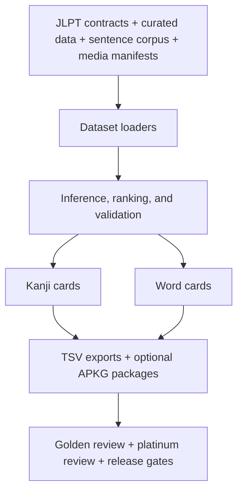

# Japanese Kanji Anki Builder

Japanese Kanji Anki Builder creates reviewed Anki flashcard decks for JLPT kanji and vocabulary. It combines curated study data, example sentences, pronunciation audio, stroke-order media, pitch-accent information, and tracked review contracts into exportable Anki decks.

Run this first:

```bash
npm run doctor
```

Kanji cards and word cards are separate learning products. A kanji card teaches one target kanji; a word card teaches one exact written form and reading.

Kanji card field preview:

```text
Kanji: 日
DisplayWord: 日
MeaningJP: day / sun
PrimaryReading: ひ
KanjiMeanings: day / sun / Japan / counter for days
StudyWordKanji: [blank]
OnReading: ジツ、 ニチ
KunReading: -か、 -び、 ひ
StrokeOrder: 65E5_日-stroke-order.gif
Audio: 65E5_日-kanji-reading-日-ひ.wav
Radical: 日
Notes: 日(ひ) - day / sun ／ 日本(にほん) - Japan ／ 日曜日(にちようび) - Sunday
ExampleSentence: 今日はいい日です。 ／ きょうはいいひです。 ／ Today is a good day.
```

Word card field preview:

```text
Word: 春雨
Reading: はるさめ
ReadingBreakdown: 春[はる] 雨[さめ]
Audio: 96E8_雨-word-reading-春雨-はるさめ.wav
PitchAccent: Pitch 1: 0
Meaning: glass noodles / spring rain
JLPTLevel: JLPT N5
CoverageRole: Reading coverage support
FocusKanji: 雨
CoversReading: 雨: さめ
KanjiBreakdown:
  春[はる] - spring, JLPT N4 kanji, stroke order 6625_春-stroke-order.gif, On: シュン, Kun: はる
  雨[さめ] - rain, stroke order 96E8_雨-stroke-order.gif, On: ウ, Kun: -さめ、 あま-、 あめ
ExampleSentence: 春雨スープを食べます。 ／ はるさめスープをたべます。 ／ I eat harusame soup.
Notes: Common food and seasonal word; retained because it gives a real learner-facing 春雨 word for the 雨 -> さめ pattern, not just coverage padding.
```

Tiny TSV excerpt:

```tsv
Surface	Reading	Meaning	Example
日	ひ	day / sun	今日はいい日です。 ／ きょうはいいひです。 ／ Today is a good day.
春雨	はるさめ	glass noodles / spring rain	春雨スープを食べます。 ／ はるさめスープをたべます。 ／ I eat harusame soup.
```

See the tracked mini fixture in [examples/n5-mini](examples/n5-mini) for sample input metadata and exact generated TSV rows. The field previews above are plain text summaries of those exported fields.



## About

Japanese Kanji Anki Builder makes Anki study decks for Japanese learners. It builds JLPT kanji decks and JLPT vocabulary decks with readings, meanings, example sentences, notes, stroke-order animations, audio, pitch accent data for word cards, and labels for kanji that are above the current deck level or outside the tracked JLPT list.

The kanji decks and word decks are separate products:

- Kanji decks teach one kanji at a time. The front of the card is only the target kanji. The back teaches that kanji's primary learner-facing reading and meaning, then uses words and sentences as support.
- Word decks teach vocabulary by exact written form and reading, such as `学校|がっこう`. A useful word can appear even if it contains harder kanji, but the card must label those kanji instead of pretending they belong to the current level.

The engineering goal is controlled output. The repository does not rely on silent fallbacks or untracked local edits for release-ready decks. Tracked JSON contracts define the JLPT kanji inventory, word eligibility, Anki note fields, media policy, and review expectations. Build scripts produce deterministic TSV exports and optional `.apkg` packages. Audit, review, readiness, and release-gate commands check for missing audio, missing stroke-order media, schema drift, bad labels, unreviewed learner-facing content, and generated content that has not been promoted into tracked source files.

Ignored local files under `data/` are workspace inputs. They are not product truth unless a tracked contract or template promotes the data into the repository.

## Scope

- Kanji decks for JLPT N5 through N1.
- Word decks grouped by JLPT level.
- Curated learner-facing readings, meanings, examples, notes, and media.
- Managed stroke-order images, looping stroke-order animations, and governed audio.
- Offline-safe preview, review, build, and package commands.
- CI smoke verification and release-gate validation.

## Quick Start

```bash
npm install
npm run doctor
npm run corpus:init
npm run curated:init
npm run words:init
npm run media:init
npm run deck:ready -- --levels=5
npm run deck:words:ready -- --levels=5
```

Kanji deck readiness requires governed audio and complete exported media fields. A level with missing exact primary-reading audio must not be treated as ready even if the managed manifest inventory reports audio coverage.

Use the workflow sections below for preview, `.apkg`, media, audio, and release commands. Native `.apkg` commands require the Python packaging toolchain. If packaging is blocked on a workstation, use the readiness output and package directory for review, and run `.apkg` packaging in a supported environment before release.

## Source Of Truth

Tracked contracts define release behavior:

- JLPT kanji taxonomy: [templates/jlpt_level_contract.json](templates/jlpt_level_contract.json)
- JLPT kanji source-evidence registry, source-use policy, source tiers, publisher-independence groups, evidence lineages, and canonical confidence states (`high_confidence`, `standard_confidence`, `disputed`, `weak_evidence`, `unknown`): [templates/jlpt_kanji_source_evidence.json](templates/jlpt_kanji_source_evidence.json)
- JLPT kanji source-input preflight config for ignored local source files and integrity pins: [templates/jlpt_kanji_source_inputs.json](templates/jlpt_kanji_source_inputs.json)
- JLPT word taxonomy: [templates/jlpt_word_level_contract.json](templates/jlpt_word_level_contract.json)
- Audio source policy: [templates/audio_source_policy.json](templates/audio_source_policy.json)
- Kanji note schema: [src/config/ankiNoteSchema.json](src/config/ankiNoteSchema.json)
- Word note schema: [src/config/ankiWordNoteSchema.json](src/config/ankiWordNoteSchema.json)
- Golden kanji review sets: [templates/golden_n5_review_set.json](templates/golden_n5_review_set.json), [templates/golden_n4_review_set.json](templates/golden_n4_review_set.json), [templates/golden_n3_review_set.json](templates/golden_n3_review_set.json), [templates/golden_n2_review_set.json](templates/golden_n2_review_set.json), [templates/golden_n1_review_set.json](templates/golden_n1_review_set.json)
- Golden word review sets: [templates/golden_n5_word_review_set.json](templates/golden_n5_word_review_set.json), [templates/golden_n4_word_review_set.json](templates/golden_n4_word_review_set.json)
- Platinum review policy: [docs/platinum-review-policy.md](docs/platinum-review-policy.md)
- Platinum kanji review sets: [templates/platinum_n5_review_set.json](templates/platinum_n5_review_set.json), [templates/platinum_n4_review_set.json](templates/platinum_n4_review_set.json), [templates/platinum_n3_review_set.json](templates/platinum_n3_review_set.json), [templates/platinum_n2_review_set.json](templates/platinum_n2_review_set.json), [templates/platinum_n1_review_set.json](templates/platinum_n1_review_set.json)
- Platinum word review sets: [templates/platinum_n5_word_review_set.json](templates/platinum_n5_word_review_set.json), [templates/platinum_n4_word_review_set.json](templates/platinum_n4_word_review_set.json)
- Word expansion signal source config and ignored-source integrity pins: [templates/word_expansion_signal_sources.json](templates/word_expansion_signal_sources.json)

## JLPT Kanji Source Evidence At A Glance

The source-evidence manifest is the governed source registry: [templates/jlpt_kanji_source_evidence.json](templates/jlpt_kanji_source_evidence.json). This table is a human-readable summary of the current lanes. The current JLPT kanji contract is an operational comparator, not final source truth, and no source lane can move kanji, move words, update decks, or change readiness by itself.

Manifest status is a lifecycle gate, not a work queue label. `planned` means registered but not under active import/review, `in_review` means manual review or source-input preparation is underway, `active` means the lane may be imported and counted according to its governed use, and `blocked` means it must not enter consensus. Non-active lanes remain inactive/non-voting until reviewed rows, source provenance, source-input integrity, and explicit activation are all in place.

| Source lane | Source / location | Current use |
| --- | --- | --- |
| `current_operational_contract` | [Tracked JLPT kanji contract](templates/jlpt_level_contract.json) | Active non-voting comparator for the current operational taxonomy |
| `tanos_legacy_direct` | [Tanos JLPT direct legacy resources](https://www.tanos.co.uk/jlpt/sharing/) | Active approved bulk-import assignment evidence for direct legacy N1, N4, and N5 mappings |
| `tanos_estimated_split` | [Tanos estimated N2/N3 resources](https://www.tanos.co.uk/jlpt/sharing/) | Active approved lower-weight assignment evidence for estimated N2/N3 splits; cannot settle taxonomy movement alone |
| `tanos_frequency_method_notes` | [Tanos sharing/method notes](https://www.tanos.co.uk/jlpt/sharing/) | Active non-voting methodology lane explaining why Tanos N2/N3 evidence is estimated |
| `kanjidic2_legacy` | [KANJIDIC2 legacy JLPT metadata](https://www.edrdg.org/wiki/KANJIDIC_Project.html) | Active approved bulk-import assignment evidence; current pinned rows are exact N1/N4/N5 only, with old JLPT 2 preserved as N2/N3 range evidence when present |
| `official_jlpt_sample_workbooks` | [Official JLPT sample questions/workbooks](https://www.jlpt.jp/e/samples/sampleindex.html?mode=pc-5) | Active occurrence-only evidence; stores only source PDF, section/page/question reference, and observed kanji |
| `japanese_textbook_consensus` | Derived from individual textbook lanes in the source manifest | Active non-voting derived summary; never manually imported as a copied list |
| `jlptsensei` | [JLPT Sensei kanji lists](https://jlptsensei.com/) | Registered restricted manual-citation assignment lane; inactive/non-voting until reviewed rows are pinned and source activated; do not scrape, copy, or republish lists |
| `shin_kanzen_master_kanji` | [Shin Kanzen Master textbooks](https://www.3anet.co.jp/np/en/list.html?series_id=4) | Active restricted manual-citation assignment lane with `129` reviewed N4 rows from the pinned ignored worksheet; `25` checked rows are marked non-importing `source_access_gap`; additional rows remain pending until exact source-level evidence is reviewed |
| `nihongo_sou_matome_kanji` | [Nihongo Sou Matome textbooks](https://www.ask-books.com/jp/somatome/) | Registered restricted manual-citation textbook lane; inactive/non-voting until reviewed rows are pinned and source activated |
| `try_jlpt_textbook` | [TRY! JLPT textbooks](https://ask-books.com/jlpt-try) | Registered restricted manual-citation textbook lane; inactive/non-voting until reviewed rows are pinned and source activated |
| `joyo_grade` | [Agency for Cultural Affairs Joyo kanji index](https://www.bunka.go.jp/seisaku/kokugo_nihongo/kokugo_shisaku/joyokanjihyo_sakuin/index.html) | Registered background-only metadata lane; inactive and not JLPT level proof |
| `bccwj_frequency` | [BCCWJ frequency lists](https://clrd.ninjal.ac.jp/bccwj/en/freq-list.html) | Registered frequency-sanity lane; inactive and not assignment truth |
| `kanji_alive` | [Kanji Alive credits/data policy](https://kanjialive.com/credits/) | Registered background-only metadata lane; inactive and not JLPT level proof |
| `jpdb` | [jpdb kanji metadata](https://jpdb.io/) | Registered frequency-sanity lane pending governed use review; inactive and not assignment truth |
| `kanshudo` | [Kanshudo terms](https://www.kanshudo.com/tc.html) | Registered but blocked from consensus until a governed use path exists |
| `wanikani` | [WaniKani terms](https://www.wanikani.com/terms) | Registered but blocked from consensus until a governed use path exists |

## Product Rules

Kanji decks:

- Each shipped kanji belongs to the tracked JLPT kanji contract.
- The JLPT kanji contract is the current operational taxonomy, not sole source truth. Source confidence is governed separately by the JLPT kanji source-evidence audit.
- N5, N4, N3, N2, and N1 kanji are fully protected by golden review coverage.
- N1 kanji golden review coverage is complete: `1231/1231` reviewed. N1 can only be treated as ready when exact primary-reading audio and level readiness both pass.
- The kanji deck learning target is the individual kanji. `DisplayWord` is the target kanji itself, and `PrimaryReading` is the most learner-useful, level-appropriate reading for that kanji.
- Compound words belong in notes, examples, and word decks; they must not replace the kanji-card anchor.
- `deck:ready` fails on export fallbacks unless `--allow-export-fallbacks` is explicit.
- Static stroke-order images and looping animations are separate managed-media readiness surfaces.
- Audio is governed by policy and required for kanji deck readiness. Exported kanji cards must use exact audio for the target kanji and exported primary reading.

Word decks:

- Word identity is `written|reading`.
- The canonical word contract means default-deck eligible.
- Source-only phrase exclusions stay tracked but do not ship as default word cards.
- The highest-numbered known JLPT kanji level in the written word is the earliest default word-deck anchor. For example, a word with N1, N3, and N4 kanji is anchored at N4.
- A word may be placed in that anchor level or in a harder/lower-numbered level when learner fit demands it.
- Later placement must carry an explicit learner-fit reason. This prevents hard or abstract words from being dumped into beginner decks just because their kanji are already known, without rejecting useful words outright.
- A word must not be placed in an easier/higher-numbered deck than its highest-numbered known constituent kanji anchor.
- Outside-JLPT constituent kanji do not choose the JLPT deck level, but they must be visibly labeled.
- Cross-level and outside-JLPT constituent kanji must be visibly labeled on the card.
- Reading coverage is scoped to the selected word-product levels. A higher-level word card can cover a lower-level reading target when those levels are built together.
- Track reading-coverage intent with `coverage.role`, `coverage.focusKanji`, and `coverage.coversReadings` when the card exists for coverage.
- Sentence orthography review is advisory. It flags likely kana-only regressions without banning natural kana usage.

Golden and platinum review:

- Golden review protects reviewed generated output from regression. It checks that exported learner-facing fields match the current governed contract.
- Golden review does not mean version 1 release approval.
- Platinum review decides whether a card deserves to ship in version 1.
- Platinum review requires field-bound source evidence, explicit quality gates, and a keep/fix/defer/remove decision. Evidence that only says a field was "reviewed" is not enough; it must name the card, exported reading, and learner-facing values it supports.
- Active word-card `japanese-source` evidence must cite a non-generated Japanese-language or dictionary source. Generated output, golden expectations, tracked starter templates, ignored local data, and local caches do not satisfy that evidence type by themselves.
- Active word platinum also enforces word-level placement: no card may ship earlier than its kanji anchor allows, and later-level placement needs a learner-fit rationale.
- Platinum review removes or defers noise instead of preserving cards that are uncommon, awkward, too advanced for the level, or only present to chase coverage.
- Platinum review may improve source data and example sentences before promotion.
- Platinum manifests are in progress. Only active `platinum` and `fixed_then_platinum` entries count as reviewed release coverage.
- Platinum entries created before the current field-bound evidence gate are not trusted release coverage until they are re-reviewed and pass the current platinum command.

## Current Baseline

| Surface | Status |
| --- | --- |
| N5 kanji | Golden-reviewed; current local deck readiness passes with complete exported media and exact primary-reading audio; platinum-reviewed at `80/80` active entries under the field-bound evidence gate |
| N4 kanji | Golden-reviewed; current local deck readiness passes with complete exported media and exact primary-reading audio; platinum review has started with `12/176` active entries; full N4 platinum remains blocked until the remaining cards are reviewed |
| N3 kanji | Golden-reviewed; current local deck readiness passes with complete exported media and exact primary-reading audio; platinum not started |
| N2 kanji | Golden-reviewed; current local deck readiness passes with complete exported media and exact primary-reading audio; platinum not started |
| N1 kanji | Golden-reviewed at `1231/1231`; current local deck readiness passes with complete exported media and exact primary-reading audio; platinum not started |
| N5 word | Expanded to `331` governed rows, but the current word-level placement audit fails with `46/331` N5 rows placed earlier than their kanji anchor allows. Older golden/platinum output passes are not release approval under the current word-level policy until the invalid rows are moved, deferred, or removed and the level is re-reviewed. |
| N4 word | Expanded to `535` governed rows, but the current word-level placement audit fails with `92/535` N4 rows missing explicit learner-fit reasons for later placement. N4 word golden/platinum readiness is blocked until those rows are moved or documented with reviewed learner-fit rationale. |

Current tracked word inventory:

- N5 canonical word rows: `331`
- N5 source-only phrase exclusions: `20`
- N4 canonical word rows: `535`
- N3 canonical word rows: `14`
- N2 canonical word rows: `15`
- N1 canonical word rows: `14`
- Current N5+N4 word rows: `866`
- Word-level placement audit currently fails: `181/909` canonical rows. The live split is `46` rows too easy for their constituent kanji and `135` later-level placements missing learner-fit reasons. By level: N5 `46/331`, N4 `92/535`, N3 `14/14`, N2 `15/15`, N1 `14/14`. Run `npm run deck:words:level-anchor-audit` for the live list.
- Word reading coverage from the current `deck:words:ready -- --levels=5,4 --require-no-active-triage` run: N5 `238/344` (`69.2%`), N4 `485/651` (`74.5%`). Coverage remains informational; useful/common/learner-fit decisions and explicit defer/reject reasons are the product guardrail.
- N5+N4 word field/media checks were previously clean, but current word readiness must now treat word-level placement violations as blockers. Golden/platinum commands are still separate from APKG import QA, manual card QA, accessibility checks, and listening review.
- JLPT kanji source evidence is governed separately from the operational taxonomy. `templates/jlpt_level_contract.json` is represented as the non-voting `current_operational_contract` comparator, not source truth. Each source declares allowed use (`bulk-import`, `manual-citation-only`, `occurrence-only`, `frequency-sanity-only`, `background-only`, `methodology-notes-only`, `operational-comparator`, `derived-summary`, `blocked`, or `needs_review`), source kind, assignment-storage permission, citation expectations, and license/use evidence.
- Current active assignment lanes are still evidence, not deck movement. `kanjidic2_legacy` has `1479` reviewed exact assignments and `0` current range rows; future old JLPT 2 rows stay N2/N3 range evidence when present. `tanos_legacy_direct` has `1478` reviewed N1/N4/N5 assignments. `tanos_estimated_split` has `734` lower-weight reviewed estimated N2/N3 assignments (`367` N2 and `367` N3) and must not settle taxonomy movement by itself. `shin_kanzen_master_kanji` now has `129` active restricted manual-citation N4 assignments from the pinned ignored worksheet; `2058` worksheet rows are still pending and `25` checked rows are marked non-importing `source_access_gap` until fuller source access can provide exact source-level evidence. `official_jlpt_sample_workbooks` is active occurrence-only evidence backed by [templates/jlpt_official_kanji_occurrences.json](templates/jlpt_official_kanji_occurrences.json), and official occurrence rows may store only level, source PDF, section, page, question reference, and observed kanji.
- Restricted or non-assignment lanes remain fenced. `tanos_frequency_method_notes` is active non-voting methodology evidence. `jlptsensei`, `nihongo_sou_matome_kanji`, and `try_jlpt_textbook` are registered restricted manual-citation lanes but remain inactive until reviewed rows, pinned source-input integrity, and explicit activation are in place. `japanese_textbook_consensus` is an active derived non-voting summary computed from the individual textbook lanes. `kanshudo` and `wanikani` are blocked from consensus until a governed use path exists; `jpdb` is frequency-sanity only. Planned legal/free sanity lanes include BCCWJ frequency sanity checks and Kanji Alive background metadata.
- The current source-evidence audit is still expected to fail on taxonomy confidence, not source-use hygiene. The latest `npm run data:audit:jlpt:sources -- --governance-strict --limit=25` run reports governance passing and evidence-depth failing: `37` high-confidence rows, `0` standard-confidence rows, `1` disputed row, `2174` weak-evidence rows, and `0` unknown rows. Issue counts are `0` missing evidence rows, `2086` insufficient independent source rows, `2075` insufficient independent evidence-lineage rows, `2083` missing Japanese-published source rows, `1` disputed consensus row, and `52` current-contract/source-consensus mismatches; source-use, license/use evidence, illegal consensus use, and disallowed stored-assignment blockers are currently `0`. The all-level source-review batch worklist currently reports `2211` rows needing governed source review: `2083` missing Japanese-published source, `87` weak evidence, `37` contract/consensus mismatch, `3` insufficient independent sources, and `1` disputed consensus, with `shin_kanzen_master_kanji` source-input progress at `129` reviewed rows plus `25` `source_access_gap` rows (`154` resolved). No deck movement, word movement, or readiness change should happen from JLPT level assumptions before taxonomy confidence is source-backed and reviewed.

Run live commands for current coverage. Do not rely on README numbers for release decisions.

## Standard Verification

Run before merging changes that affect decks, contracts, media, or release behavior:

```bash
npm test
npm run lint
npm run data:audit:jlpt
npm run data:audit:jlpt:sources -- --governance-strict --limit=25
npm run data:audit:jlpt:source-levels -- --level=5 --limit=25
npm run data:audit:jlpt:official-occurrences -- --strict
npm run data:audit:jlpt:source-inputs -- --source=tanos_legacy_direct --strict
npm run data:audit:jlpt:source-inputs -- --source=tanos_estimated_split --strict
npm run data:audit:jlpt:source-inputs -- --source=kanjidic2_legacy --strict
npm run data:merge:jlpt:source-batch -- --source=shin_kanzen_master_kanji --batch=downloads/shin-kanzen-master-kanji-evidence-working-batch.tsv
npm run data:pin:jlpt:source-input -- --source=shin_kanzen_master_kanji --reason="merged reviewed Shin Kanzen source batch"
npm run data:audit:jlpt:words
npm run deck:words:level-anchor-audit -- --level=5
npm run data:audit:audio -- --json
npm run deck:review:accessibility -- --deck-kind=kanji
npm run deck:review:accessibility -- --deck-kind=word
npm run product:artifacts:n5
npm run product:artifacts:kanji:n5:preflight
npm run product:readiness:n5
npm run release:gate
```

`product:artifacts:n5` builds a fresh N5 word TSV from tracked templates only, with network inference disabled and ignored local `data/` word, sentence, JLPT, cache, and media inputs excluded. It validates schema, canonical row count, canonical-only governance, and deterministic repeated output. It does not yet certify tracked-source kanji TSVs, `.apkg` files, or managed media packages.

`product:artifacts:kanji:n5:preflight` inspects tracked templates and reports whether N5 kanji TSV certification is possible without ignored local `data/` inputs. It currently reports `certifiable: no` because explicit on-yomi, kun-yomi, and rich-source provenance are not yet tracked as product contracts. Component/radical source data is tracked in `templates/kanji_component_contract.json`. Use `-- --require-certifiable` only when the remaining contracts exist and the command is expected to fail closed.

`data:audit:jlpt:sources` audits the operational JLPT kanji contract against the independent source-evidence registry. It is intentionally separate from deck generation and product readiness: it computes external source consensus from active voting sources that are legally/use-policy allowed to store assignment judgments, then compares the current operational contract against that external consensus. Frequency, background, occurrence, methodology, operational, derived, blocked, and `needs_review` lanes do not vote in the current assignment-consensus engine. The audit now reports both `governanceValid` and `evidenceDepthValid`: use `--governance-strict` when CI should fail only on source-use, license, reference-integrity, illegal consensus-use, declared-mismatch, or storage-governance regressions while the evidence-depth work is still honestly incomplete. Full `--strict` still fails until missing independent/Japanese-published evidence, disputes, and contract/consensus mismatches are resolved. The text report includes per-contract-level confidence counts, missing/disagreement work-queue counts, missing Japanese-published source counts, publisher-independence groups, and disputed vote-weight samples so missing evidence, shared lineage, publisher signals, and tie shapes are visible without reading JSON. Confidence ids are the canonical states; the manifest's confidence definitions only describe release meaning and blocking behavior. The audit reports current contract level, source consensus level, agreement count, publisher-independence count, independent evidence-lineage count, computed textbook consensus, confidence reasons, disagreement sources, confidence, source-use profile blockers, license/use evidence blockers, illegal consensus-use blockers, disallowed assignment-storage blockers, and whether the current contract matches consensus without changing the active contract or any decks. Re-run word placement audits after taxonomy confidence is governed and any kanji contract change is proposed, because word placement depends on kanji levels.

`data:audit:jlpt:source-levels` is a read-only companion audit for source-claimed level deltas. It answers questions like "how many kanji do active sources call N5, how many are already in the current N5 contract, and which source-backed candidates are missing from the current N5 deck?" by reporting current contract counts, active source-candidate counts, source-consensus counts, per-source claim counts, missing source candidates from the current level, missing source-consensus rows, disputed missing candidates, current-level rows whose source consensus points elsewhere, and current-level rows without same-level source support. Add `--worklist` to append an all-level source-lane batch packet, or `--worklist-only` to show only that packet, ordered by batch value: disputed source votes, missing evidence, missing Japanese-published evidence, contract/source consensus mismatches, independence gaps, and weak evidence, with each priority bucket ordered N5 through N1. Each worklist row lists the current level, all source-candidate levels, consensus level, vote weights, and exact levels that must be checked in the manual source lane so review is not narrowed to one adjacent N level. It also annotates resolved source-input worksheet progress, including active or in-review rows marked `reviewed`, `blocked`, or `source_access_gap`; those annotations are progress markers only, and reviewed rows vote only after they are imported into the governed source-evidence manifest. Use `data:audit:jlpt:sources` as the governance-closure view for final dispute and contract-movement decisions. This command is informational only: it does not move kanji, move words, update decks, or change readiness.

`data:audit:jlpt:official-occurrences` reports the tracked official occurrence manifest without changing decks or assignments. With `--source=<ignored-local.json|tsv>` it extracts observed kanji from locally extracted official PDF text, then emits only minimal occurrence rows: `level`, `sourcePdf`, `section`, `page`, `questionRef`, and `observedKanji`. Prefer JSON for raw PDF text because TSV source rows must keep text cells on one physical line. Add `--write` only to write the minimal occurrence manifest or TSV; the source text stays ignored and must not be committed. PDF extraction must be Unicode-verified and manually reduced to question/page-scoped occurrence rows before writing. Do not import raw page-level extraction if it includes headings, instructions, answer boilerplate, or unreliable question references. If an extractor produces zero observed kanji or corrupt references, leave the dry-run blocked and use OCR/manual review instead of manufacturing occurrence evidence. This lane is positive occurrence evidence from official JLPT samples/workbooks only: occurrence can support later review, but it is not a complete JLPT kanji list and cannot assign or move a kanji by itself. Official source policy is intentionally conservative because the JLPT sample/workbook page and site policy allow only limited citation/summarization and warn that some questions include third-party works.

`data:audit:jlpt:source-inputs` preflights ignored local source files before they can become source evidence. It verifies the configured source id, evidence manifest source status, license status, SHA-256, byte size, row count, per-row kanji/level validity, review status, citation, and evidence reference. It reports resolved rows as `reviewed + blocked + source_access_gap`, so checked rows that cannot yet become assignment evidence still count as governed review progress. It is read-only and does not import assignments, move kanji, move words, or change readiness. `reviewed` rows must have valid levels, citations, and evidence references; blank `needs_review` rows remain pending so manual source worksheets can be reviewed in governed batches without becoming evidence. Use `source_access_gap` only after permitted source material has actually been checked and exact source-level assignment proof is not available yet; it is non-importing, non-voting, not negative evidence, and is skipped by later batch-template generation until fuller source access changes the row. The `tanos_legacy_direct` input imports only the explicit N1, N4, and N5 base kanji lists. The `tanos_estimated_split` input imports only Tanos N2/N3 estimated split rows as lower-weight estimated evidence; it is visibly labeled and must not move kanji, move words, or claim final taxonomy confidence by itself. `tanos_frequency_method_notes` explains the estimated method and does not vote. The current KANJIDIC2 legacy input maps old JLPT 4 -> N5, old 3 -> N4, and old 1 -> N1 with `1479` exact reviewed rows and `0` old JLPT 2 range rows; if old JLPT 2 appears in a future pinned input, it is retained as N2/N3 range evidence and must not be converted into an exact N2 or N3 vote without governed sources. The `jlptsensei` input is restricted manual evidence only: create a blank worksheet, review level judgments with permitted citations and evidence references, pin integrity, and activate intentionally before import.

`data:merge:jlpt:source-batch` merges a small ignored batch worksheet back into the configured full ignored source worksheet. It is dry-run by default; add `--write` only after reviewing the reported changed rows and blockers. For repeated source-depth review, reuse one stable ignored batch path such as `downloads/shin-kanzen-master-kanji-evidence-working-batch.tsv` and overwrite it for each 10-row pass instead of accumulating numbered scratch files. The merge rejects unknown columns, duplicate or missing kanji, batch kanji outside the source worksheet, invalid review statuses, and accidental downgrades from `reviewed` back to pending. It still does not import assignments, move kanji, move words, update decks, or change readiness; see [docs/source-evidence-batching.md](docs/source-evidence-batching.md) for the reviewed-batch, milestone-import, and release-gate cadence.

`data:pin:jlpt:source-input` recomputes the SHA-256, byte size, and parsed row count for one configured ignored source worksheet and updates only those tracked integrity pins plus `checkedAt` when `--write` is supplied. It requires `--reason=<why>` in write mode, refuses checkedAt-only churn when the pins already match, and does not import assignments, move kanji, move words, update decks, or change readiness. Use it after a written source-batch merge and before strict source-input preflight at an import milestone.

`data:normalize:kanjidic2-jlpt` converts an ignored local KANJIDIC2 XML or `.xml.gz` file into the normalized TSV shape required by `templates/jlpt_kanji_source_inputs.json`. The generated TSV remains ignored local input until its SHA-256, byte size, and row count are pinned. `data:import:jlpt:source-input -- --source=kanjidic2_legacy` then performs a dry-run evidence import after preflight; add `--write` only when updating the tracked source-evidence manifest. Source imports materialize only changed kanji rollup entries by default; add `--full-rematerialize` only for intentional full manifest regeneration after source policy, source config, or materialization logic changes. Neither command moves kanji, moves words, updates decks, or changes readiness.

`data:normalize:tanos-jlpt-kanji` converts ignored local Tanos source text files into the normalized TSV shape required by `templates/jlpt_kanji_source_inputs.json`. The default lane normalizes only N1/N4/N5 direct legacy base files for `tanos_legacy_direct`; `-- --lane=estimated-split` normalizes only extracted N2/N3 PDF text for `tanos_estimated_split`. The generated TSV remains ignored local input until its SHA-256, byte size, and row count are pinned. `data:import:jlpt:source-input -- --source=tanos_legacy_direct` or `-- --source=tanos_estimated_split` then performs a dry-run evidence import after preflight; add `--write` only when updating the tracked source-evidence manifest. Source imports materialize only changed kanji rollup entries by default; add `--full-rematerialize` only for intentional full manifest regeneration after source policy, source config, or materialization logic changes. Neither command moves kanji, moves words, updates decks, or changes readiness.

`data:template:jlpt:source-input` creates an ignored worksheet for one selected manual source lane, such as `jlptsensei` or a Japanese-published textbook source. It deliberately leaves `level`, `citation`, and `evidenceRef` blank so no row can become evidence until a reviewer fills permitted source citations, pins the TSV integrity in `templates/jlpt_kanji_source_inputs.json`, and activates that individual source intentionally. Use `--priority=source-review-worklist --limit=<n> --out=<ignored-batch.tsv>` for the default governed batch flow: it orders all levels together by source-lane batch value, disputed consensus first, then missing evidence, missing Japanese-published evidence, contract/consensus mismatches, independence gaps, and weak evidence; within each priority bucket it reviews N5 through N1. It skips rows already `reviewed`, `blocked`, or `source_access_gap` in the selected full worksheet, and requires explicit `--out` so it cannot overwrite that worksheet. Use `--priority=source-gaps` only when intentionally scanning the operational contract order by evidence-depth issue, and use `--priority=source-level-deltas --source-level=<N1-N5> --out=<ignored-batch.tsv>` only for a targeted source-claimed level delta investigation. For batch review, pass `--limit=<n>` with a reusable `--out` path rather than creating numbered files. Shin Kanzen Master, Nihongo Sou Matome, and TRY! remain `manual-citation-only`: review from actual source access, store only reviewer level judgment plus citation/evidenceRef/notes, and do not copy textbook lists or passages. A row becomes `reviewed` only when the source material supports that exact source level judgment; adjacent-level schedules, cumulative review/basic-kanji appendices inside higher-level volumes, review tables, or appearance-only evidence are not assignment proof. Keep rows `needs_review` until they are actually checked. Use `source_access_gap` only when available permitted source material has been checked and does not provide exact assignment proof yet; use `blocked` only for a source-use or worksheet defect that makes the row unusable for that source lane. The TSV still exposes only import-safe manual-review fields; priority metadata appears in the command report and JSON output, not as source truth. `data:template:jlpt:textbook-source` remains an alias for the same governed worksheet flow. `japanese_textbook_consensus` is derived from individual textbook lanes and is not manually imported.

`product:readiness:n5` runs the current automated N5 product checkpoint: JLPT kanji and word audits, governed audio provenance, tracked-source N5 word TSV generation, and N5 kanji and word golden reviews. It must not be used to claim N5 word release readiness while `npm run deck:words:level-anchor-audit -- --level=5` fails. It does not run or gate on the JLPT kanji source-evidence audit yet; that audit is currently read-only transparency until taxonomy confidence is governed and passing. It still does not validate tracked-source kanji TSVs, `.apkg` artifacts, manual Anki import review, mobile behavior, screen-reader behavior, or listening QA. Run the applicable platinum command separately when a level is being version-1 locked.

`release:gate` validates deterministic smoke-fixture artifacts and packaging contracts. It does not certify public product deck readiness. Add level-specific readiness, golden review, accessibility, provenance, and manual QA commands for the surface being changed.

## Core Workflows

### Setup

```bash
npm run doctor
npm run doctor:voicevox
npm run deck:readiness
```

- `doctor` checks datasets, local files, media folders, managed media, tooling, and next steps.
- `doctor:voicevox` verifies the local VOICEVOX Nemo engine and pinned release speaker.
- `deck:readiness` reports per-level deck readiness.

### Bootstrap Local Data

```bash
npm run corpus:init
npm run curated:init
npm run words:init
npm run media:init
```

Useful variants:

```bash
npm run corpus:init -- --merge
npm run curated:init -- --merge
npm run curated:init -- --refresh-starter
npm run words:init -- --merge
npm run words:init -- --refresh-starter
```

Tracked starter files are the baseline. Local ignored files may add workspace overrides. Runtime loaders refresh stale starter-derived local rows in memory before builds and audits.

### Preview And Review

```bash
npm run deck:preview -- --level=5 --limit=5
npm run deck:preview -- --kanji=日,本,学
npm run deck:platinum:batch -- --level=5 --limit=12
npm run deck:platinum:batch -- --level=5 --kanji=父,生,男
npm run deck:words:platinum:batch -- --level=5 --limit=8
npm run deck:words:platinum:batch -- --level=5 --words=今日:きょう,八日:ようか
npm run deck:words:level-anchor-audit -- --level=5
npm run deck:review:n5
npm run deck:review:n4
npm run deck:review:n3
npm run deck:review:n2
npm run deck:review:n1
npm run deck:review:coverage
npm run deck:review:coverage -- --level=1
node scripts/reviewPlatinumKanjiLevel.js --level=5
npm run deck:words:review:n5
node scripts/reviewPlatinumWordLevel.js --level=5
```

Golden review protects learner-facing card output rather than raw field presence. Platinum review is the final release-quality pass. `deck:platinum:batch` is a read-only pre-review report for kanji cards: it shows the generated surface, hard-rule checks, risk flags, current platinum status, and next missing queue before any manifest edits. `deck:words:platinum:batch` provides the matching read-only packet for word cards: it shows exact written-reading identity, generated card fields, sentence lines, exact word audio, pitch source/render status, lookup links, risk flags, and a suggested review step. Batch reports do not create platinum entries or prove release readiness. The `npm run deck:platinum:n5` and `npm run deck:words:platinum:n5` commands are full-level gates and fail until every generated N5 card has an active platinum entry.

### Build Kanji Decks

```bash
npm run deck:ready -- --levels=5
npm run deck:apkg -- --levels=5
```

`deck:ready` validates setup, syncs media, builds exports, packages files under `out/build/package`, rebuilds from a clean package directory, reports managed manifest coverage and exported card media completeness, and fails on export fallbacks by default. Exported card media completeness is the release-critical signal for kanji deck media readiness.

Use `--allow-export-fallbacks` only for an explicitly degraded local artifact.

### Build Word Decks

```bash
npm run deck:words:ready -- --levels=5
npm run deck:words:apkg -- --levels=5
```

Word readiness reports:

- shipped row governance
- canonical inventory counts
- source-only exclusions
- word-level placement violations
- explicit reading-coverage contract counts
- selected-level reading coverage
- active triage backlog
- deck-policy violations
- sentence orthography review
- reading-breakdown review
- card-back field readiness
- pitch-accent review
- true looping animation coverage
- word-audio review where enabled

Use the N5 guard when changing stabilized N5 word content:

```bash
npm run deck:words:ready -- --levels=5 --require-no-active-triage
```

### Plan Word Reading Coverage

```bash
npm run deck:words:gap-plan:n4 -- --limit=50
npm run deck:words:gap-plan:n4 -- --only=contract-extensions --quality=strong --limit=15 --suggestions=3
```

The gap planner ranks open reading coverage work and suggests candidate support words from:

- tracked word entries
- sentence corpus rows
- local kanjiapi word cache evidence

Planner output is advisory. A suggested card still needs canonical contract coverage, explicit reading intent, cross-level labels, media, sentence review, and deck-policy validation before shipping.

### Plan Word Inventory Expansion

```bash
npm run deck:words:expansion-candidates:n5 -- --source=downloads/n5-vocab.tsv --source-label=jlptstudy.net-n5 --limit=50
npm run deck:words:expansion-candidates:n5 -- --source=downloads/n5-vocab.tsv --source-label=jlptstudy.net-n5 --kanji-scope=target-level --require-source-level
```

The expansion candidate report is a read-only post-coverage tool. Use it after the current reading-coverage pass to compare an explicit sourced vocabulary list against the governed word contract. It filters for written-reading rows that contain target-level kanji, are not already governed or excluded, and fit the requested kanji scope:

- `at-or-below` keeps words whose kanji are all target-level or easier; this is the default.
- `target-level` keeps only words whose kanji are all from the requested level.
- `known-jlpt` allows harder known JLPT kanji but reports them for review.
- `any` allows outside-JLPT kanji but reports them for review.

Expansion candidates are not product truth. A candidate list may reveal useful vocabulary, but every promoted word still needs source/commonness review, level-fit review, examples, reading breakdowns, kanji labels, audio, pitch policy compliance, golden/platinum review, and readiness validation.

The report deduplicates exact `written|reading` identities and also flags same-written candidates that already have another governed or excluded reading. Those warnings are review prompts, not automatic rejection: approve multiple readings only when the extra card is useful, common, level-fit, and worth teaching as its own word identity.

Tracked triage decisions live in [templates/word_inventory_expansion_triage.json](templates/word_inventory_expansion_triage.json). These decisions are read-only planning metadata, not card approvals. `keep_candidate` means "worth source-checking next"; it does not bypass the 8-card word platinum review batch size, generated-surface inspection, golden review, platinum evidence, media review, or readiness gates.

### Check Word Expansion Signals

```bash
npm run deck:words:expansion-signals -- --levels=5,4
```

The expansion signal command answers the narrow "fully expanded under current restraints?" question for each selected word level. It has three separate signals:

- Reading signal: `exhausted` only when active reading-gap triage is cleared. Remaining coverage gaps may still exist when they are explicitly deferred variants or lower learner value.
- Enhancement signal: `exhausted` only when the configured source vocabulary list has no remaining `keep_candidate` rows and no untriaged review candidates.
- Placement signal: `resolved` only when canonical word rows are not earlier than their highest-numbered known kanji anchor and any later learner-fit placement has a tracked `levelPlacement.reason`.

The configured source TSVs under `downloads/` are ignored local inputs, so the signal source config pins their source URL, source label, SHA-256, byte size, and parsed row count. The enhancement signal verifies those pins before reporting `exhausted`; a mismatch reports `source_mismatch` and strict mode fails instead of trusting an unverified local file.

The signal is deliberately not a release claim. It does not replace golden review, platinum review, APKG import QA, accessibility checks, media/listening QA, or readiness gates. Levels without configured source lists, matching source integrity, generated TSV exports, or resolved placement policy report that blocker instead of pretending to be complete.

## Media Workflows

### Stroke Order

```bash
npm run media:plan -- --level=5 --limit=25
npm run media:import:stroke-order -- --input-dir=/path/to/files
npm run media:import:kanjivg -- --input-dir=/path/to/extracted-kanjivg/kanji --level=4
npm run media:sync -- --level=5 --limit=25
npm run media:report:animations -- --level=5 --limit=25
npm run data:audit:stroke-order -- --json
```

Managed animation priority:

1. `REMOTE_STROKE_ORDER_ANIMATION_BASE_URL`
2. `REMOTE_STROKE_ORDER_ANIMCJK_BASE_URL`
3. local source files

True animation coverage requires real looping animation assets. Static images and SVG fallbacks do not satisfy that rule. Use the configured GitHub animation mirrors or reviewed local source files.

Stroke-order release provenance is governed by `templates/stroke_order_source_policy.json`; run the audit before treating new media as release-ready. The automated gate verifies approved source policy, managed manifests, and target-bound review evidence. It does not prove stroke-sequence correctness by itself. Platinum review must state that the stroke-order media was visually checked for the target kanji.

### Audio

```bash
npm run media:voicevox -- --list-speakers
npm run media:voicevox -- --level=5 --speaker-id=10005 --concurrency=4
npm run media:voicevox:words -- --level=5 --speaker-id=10005 --concurrency=4
npm run media:sync -- --level=5 --limit=100
npm run media:sync:words -- --level=5
npm run media:review:audio -- --level=5 --limit=25
npm run media:review:word-audio -- --level=5 --limit=25
npm run data:audit:audio -- --json
```

The release audio policy requires:

- VOICEVOX Nemo
- pinned release speaker `女声1`, style id `10005`
- explicit source, voice, locale, and category provenance
- one release audio source
- no remote-audio release provider

Generated audio must pass review before release.

## CI And Release

GitHub Actions verification:

- Ubuntu lint and full test matrix on Node 18, 20, and 22.
- Cross-platform smoke matrix on Ubuntu, Windows, and macOS for Node 18 and 22.
- Ubuntu release smoke gate on Node 22 with native `.apkg` packaging validation for fixture artifacts.

Release process:

- Follow [docs/release-process.md](docs/release-process.md).
- Keep [CHANGELOG.md](CHANGELOG.md) current.
- Use `v<package.json version>` tags.
- Keep [NOTICE.md](NOTICE.md) current for shipped attribution.

Repository governance:

- [docs/branch-protection.md](docs/branch-protection.md)
- [.github/CODEOWNERS](.github/CODEOWNERS)
- [CLAUDE.md](CLAUDE.md)

## Command Reference

| Command | Purpose |
| --- | --- |
| `npm test` | Run the full test suite |
| `npm run lint` | Run ESLint |
| `npm run ci:smoke` | Build deterministic smoke artifacts |
| `npm run release:gate` | Validate smoke-fixture release artifact contracts |
| `npm run product:artifacts:n5` | Build and validate the tracked-source N5 word TSV artifact |
| `npm run product:artifacts:kanji:n5:preflight` | Report whether tracked-source N5 kanji TSV certification is possible |
| `npm run product:readiness:n5` | Run the automated N5 product readiness checkpoint |
| `npm run doctor` | Check setup, coverage, readiness, and next steps |
| `npm run doctor:voicevox` | Verify local governed VOICEVOX setup |
| `npm run deck:readiness` | Report per-level quality gates |
| `npm run deck:preview` | Preview kanji cards |
| `npm run deck:platinum:batch -- --level=5 --limit=12` | Build a read-only kanji platinum pre-review packet |
| `npm run deck:ready` | Build and package kanji TSV artifacts |
| `npm run deck:apkg` | Build kanji `.apkg` artifacts |
| `npm run deck:review:n5` | Run the N5 kanji golden benchmark |
| `npm run deck:review:n4` | Run the N4 kanji golden benchmark |
| `npm run deck:review:n3` | Run the N3 kanji golden benchmark |
| `npm run deck:review:n2` | Run the N2 kanji golden benchmark |
| `npm run deck:review:n1` | Run the N1 kanji golden benchmark |
| `npm run deck:review:coverage` | Audit golden-review coverage |
| `npm run deck:platinum:n5` | Run the N5 kanji platinum release-quality benchmark |
| `npm run deck:platinum:n4` | Run the N4 kanji platinum release-quality benchmark |
| `npm run deck:platinum:n3` | Run the N3 kanji platinum release-quality benchmark |
| `npm run deck:platinum:n2` | Run the N2 kanji platinum release-quality benchmark |
| `npm run deck:platinum:n1` | Run the N1 kanji platinum release-quality benchmark |
| `npm run deck:words:ready` | Build and package word TSV artifacts |
| `npm run deck:words:apkg` | Build word `.apkg` artifacts |
| `npm run deck:words:platinum:batch -- --level=5 --limit=8` | Build a read-only word platinum pre-review packet |
| `npm run deck:words:review:n5` | Run the N5 word golden benchmark |
| `npm run deck:words:platinum:n5` | Run the N5 word platinum release-quality benchmark |
| `npm run deck:words:platinum:n4` | Run the N4 word platinum release-quality benchmark |
| `npm run deck:words:level-anchor-audit -- --level=5` | Fail when canonical word rows are too early for their kanji anchor or later without learner-fit rationale |
| `npm run deck:words:completion:n5` | Audit N5 word inventory and reading coverage |
| `npm run deck:words:completion:n4` | Audit N4 word inventory and reading coverage |
| `npm run deck:words:reading-audit:n4` | Audit N4 word reading coverage |
| `npm run deck:words:triage:n4` | Classify N4 word reading gaps |
| `npm run deck:words:gap-plan:n4 -- --limit=50` | Rank the next N4 word coverage batch |
| `npm run deck:words:expansion-candidates:n5 -- --source=downloads/n5-vocab.tsv --source-label=jlptstudy.net-n5` | Diff a sourced vocabulary list into read-only word expansion candidates |
| `npm run deck:words:expansion-signals -- --levels=5,4` | Summarize per-level reading and enhancement expansion exhaustion without claiming release readiness |
| `npm run data:audit:jlpt` | Audit kanji taxonomy and starter alignment |
| `npm run data:audit:jlpt:sources -- --governance-strict` | Audit JLPT kanji source evidence and fail only on source-governance regressions while evidence depth remains incomplete |
| `npm run data:audit:jlpt:source-levels -- --worklist-only --limit=10` | Report the focused all-level governed review packet with current level, candidate levels, consensus, vote weights, and resolved source-input worksheet progress without changing decks or readiness |
| `npm run data:audit:jlpt:source-levels -- --level=5` | Report active source-claimed N5 candidates, candidates missing from the current N5 contract, disputed missing candidates, resolved source-input worksheet progress, and current rows lacking same-level source support without changing decks or readiness |
| `npm run data:audit:jlpt:official-occurrences` | Report or extract official JLPT positive occurrence evidence without storing question text or assigning levels |
| `npm run data:audit:jlpt:source-inputs -- --source=tanos_legacy_direct` | Preflight the pinned local Tanos direct legacy normalized source file before source-evidence import |
| `npm run data:audit:jlpt:source-inputs -- --source=tanos_estimated_split` | Preflight the pinned local Tanos estimated N2/N3 normalized source file before source-evidence import |
| `npm run data:audit:jlpt:source-inputs -- --source=kanjidic2_legacy` | Preflight a pinned local JLPT kanji source file before source-evidence import |
| `npm run data:audit:jlpt:source-inputs -- --source=jlptsensei` | Preflight a restricted manual JLPT Sensei source worksheet before source-evidence import |
| `npm run data:merge:jlpt:source-batch -- --source=shin_kanzen_master_kanji --batch=downloads/shin-kanzen-master-kanji-evidence-working-batch.tsv` | Dry-run merge a reusable local source-decision batch into its full ignored source worksheet without importing evidence or changing decks |
| `npm run data:normalize:kanjidic2-jlpt` | Normalize ignored local KANJIDIC2 XML into the pinned source-input TSV shape |
| `npm run data:normalize:tanos-jlpt-kanji` | Normalize ignored local Tanos N1/N4/N5 base text files into the pinned source-input TSV shape |
| `npm run data:normalize:tanos-jlpt-kanji -- --lane=estimated-split` | Normalize ignored local Tanos N2/N3 estimated PDF text into the pinned source-input TSV shape |
| `npm run data:import:jlpt:source-input -- --source=tanos_legacy_direct` | Dry-run import of the passing Tanos direct legacy source input into the JLPT kanji source-evidence manifest |
| `npm run data:import:jlpt:source-input -- --source=tanos_estimated_split` | Dry-run import of the passing Tanos estimated N2/N3 source input into the JLPT kanji source-evidence manifest |
| `npm run data:import:jlpt:source-input -- --source=kanjidic2_legacy` | Dry-run import of a passing source input into the JLPT kanji source-evidence manifest |
| `npm run data:import:jlpt:source-input -- --source=<source-id> --full-rematerialize` | Intentionally rebuild every materialized kanji rollup entry after source policy, source config, or materialization logic changes |
| `npm run data:template:jlpt:source-input -- --source=jlptsensei --level=5` | Create an ignored manual-review worksheet for a restricted JLPT kanji source lane |
| `npm run data:template:jlpt:textbook-source -- --source=shin_kanzen_master_kanji --priority=source-review-worklist --limit=10 --out=downloads/shin-kanzen-master-kanji-evidence-working-batch.tsv` | Create or overwrite one reusable ignored all-level manual-review batch for a Japanese-published textbook source lane, ordered by source-lane batch value |
| `npm run data:template:jlpt:textbook-source -- --source=shin_kanzen_master_kanji --level=5 --priority=source-gaps --limit=10 --out=downloads/shin-kanzen-master-kanji-evidence-working-batch.tsv` | Create or overwrite one reusable ignored manual-review batch for a Japanese-published textbook source lane, ordered by current source-evidence blockers for a deliberately scoped contract level |
| `npm run data:template:jlpt:textbook-source -- --source=shin_kanzen_master_kanji --priority=source-level-deltas --source-level=5 --limit=10 --out=downloads/shin-kanzen-master-kanji-evidence-working-batch.tsv` | Create or overwrite one reusable ignored manual-review batch for active source-claimed deltas outside the current operational contract |
| `npm run data:audit:jlpt:words` | Audit word taxonomy and starter alignment |
| `npm run data:audit:audio` | Audit managed audio provenance |
| `npm run data:sync:jlpt` | Sync local ignored JLPT data to the tracked contract |
| `npm run corpus:init` | Create or merge sentence corpus data |
| `npm run curated:init` | Create or merge curated kanji data |
| `npm run words:init` | Create or merge curated word data |
| `npm run media:init` | Create media source folders and `.env` |
| `npm run media:plan` | Report missing media and accepted filenames |
| `npm run media:sync` | Sync media into managed storage |

## Local Data

Expected ignored workspace data:

- `data/kanji_jlpt_only.json`
- `data/KRADFILE` as a local fallback only; governed deck builds prefer `templates/kanji_component_contract.json`
- `data/sentence_corpus.json`
- `data/curated_study_data.json`
- `data/word_study_data.json`

Managed media:

- `data/media/`

Media source folders:

- `data/media_sources/stroke-order/images/`
- `data/media_sources/stroke-order/animations/`
- `data/media_sources/audio/`

Optional `.env` settings:

- `NODE_ENV`
- `WORD_STUDY_DATA_PATH`
- `VOICEVOX_ENGINE_URL`
- `VOICEVOX_SPEAKER_ID`
- `REMOTE_STROKE_ORDER_IMAGE_BASE_URL`
- `REMOTE_STROKE_ORDER_ANIMATION_BASE_URL`
- `REMOTE_STROKE_ORDER_ANIMCJK_BASE_URL`
- `REMOTE_AUDIO_BASE_URL`
- `MEDIA_MANIFEST_CACHE_TTL_MS`

## Pitch Accent Provenance

Word-card pitch accent data is source-governed separately from the starter vocabulary contract:

- `templates/word_pitch_accent_data.json` stores pitch patterns and source IDs.
- `npm run data:import:pitch:kanjium -- --levels=5` imports dictionary-backed matches from `downloads/kanjium/accents.txt`; use `--levels=4` for N4.
- `npm run data:import:pitch:voicevox -- --levels=5 --allow-reading-fallback` fills remaining generated pronunciation guidance from the local VOICEVOX Nemo engine; use `--levels=4` for N4.

Kanjium-derived entries are dictionary data under CC BY-SA 4.0 and must keep attribution in release notes. VOICEVOX-derived entries are generated accent-query results and are tracked with a different source ID; they are not described as dictionary-verified.

## Deck Model

Kanji card fields include:

- `DisplayWord`
- `MeaningJP`
- `PrimaryReading`
- `KanjiMeanings`
- `StudyWordKanji`
- `OnReading`
- `KunReading`
- `StrokeOrder`
- `Audio`

The front of a kanji card shows only the target kanji. The back starts with `PrimaryReading` plus the learner-facing meaning associated with that reading from `MeaningJP`. The chosen reading must be the most learner-useful, level-appropriate reading for the kanji, not simply the first dictionary reading or whichever reading already has audio. Broader kanji meanings live separately in `KanjiMeanings`; they must not be collapsed into the primary-reading line. Curated starter entries may use `blockedMeanings` to suppress low-value dictionary glosses from `KanjiMeanings` without hiding the governed learner-facing meaning. `StrokeOrder` is the single learner-facing looping stroke-order animation field; static stroke-order images remain managed media/provenance inputs but are not exported as Anki note fields. `DisplayWord` remains an exported contract field and must equal the target kanji, but it is not repeated as a visible card-back study word. `StudyWordKanji` is blank for kanji cards because the learning target is the individual kanji; compounds and study words belong in ruby-formatted notes, examples, and word decks. The build pipeline rejects kanji exports that replace the target-kanji anchor with a compound or omit the primary reading. Audio is selected only when managed media has an exact `kanji-reading` asset for the target kanji and exported primary reading.

Word card fields include:

- `Word`
- `Reading`
- `ReadingBreakdown`
- `Audio`
- `PitchAccent`
- `Meaning`
- `JLPTLevel`
- `CoverageRole`
- `FocusKanji`
- `CoversReading`
- `KanjiBreakdown`
- `ExampleSentence`
- `Notes`

The front of a word card shows the written study word without furigana. The back uses `ReadingBreakdown` as the primary reading surface, then shows audio, source-labeled pitch accent guidance when available, meaning, JLPT label, coverage role, example sentence, notes, and a constituent kanji breakdown.

`ReadingBreakdown` is required for every shipped word card. Kanji words render learner-facing ruby furigana, kana-only words render the kana reading in the same position, and whole-word ruby fallback is used when safe segmentation is not available. Irregular compounds use curated overrides instead of unsafe automatic segmentation.

`PitchAccent` is a dedicated pronunciation field. In exported word cards it renders a learner-facing Tokyo pitch contour graph with mora labels and no redundant source-pattern caption. Leave it blank unless the accent pattern comes from a product-approved source in `templates/word_pitch_accent_data.json` or an explicitly curated, source-declared override. Generated VOICEVOX pitch may ship only with the visible `Generated pitch (unverified)` label; the label is a learner/reviewer warning, not dictionary-backed pitch proof.

Word deck readiness verifies pitch accent accuracy against the governed source pattern. A word row with a non-empty `PitchAccent` field is not enough: the rendered pitch contour must decode to the same accent numbers as the tracked source entry, and the source entry must belong to the same written word and reading. Rows with missing, ungoverned, invalid, source/render-mismatched, source-identity-mismatched, or generated-but-unlabeled pitch accent block readiness. Generated pitch provenance by itself does not block readiness when the governed source identity, source/render match, and visible generated label all pass.

`KanjiBreakdown` includes constituent meanings, readings, stroke-order animation, and cross-level badges such as `JLPT N4 kanji`. Its readings are bound to `ReadingBreakdown`: safe per-kanji ruby drives the constituent reading (`電車` shows `車 -> しゃ`), while non-decomposable whole-word ruby is labeled as `word reading: ...` and `CoversReading` uses the whole written surface (`今日: きょう`) instead of pretending each kanji has that reading. Word readiness fails when a constituent panel drifts from deterministic ruby, when whole-word ruby is counted as a per-kanji reading, when `FocusKanji` names a kanji that is not in the written word, or when word-level placement is too early for the word's kanji anchor or later without an explicit learner-fit rationale.

## Output Layout

Kanji build artifacts:

- `out/build/exports/`
- `out/build/reports/`
- `out/build/build-summary.json`
- `out/build/package/`

Word build artifacts:

- `out/word-build/exports/`
- `out/word-build/reports/`
- `out/word-build/build-summary.json`
- `out/word-build/package/`
