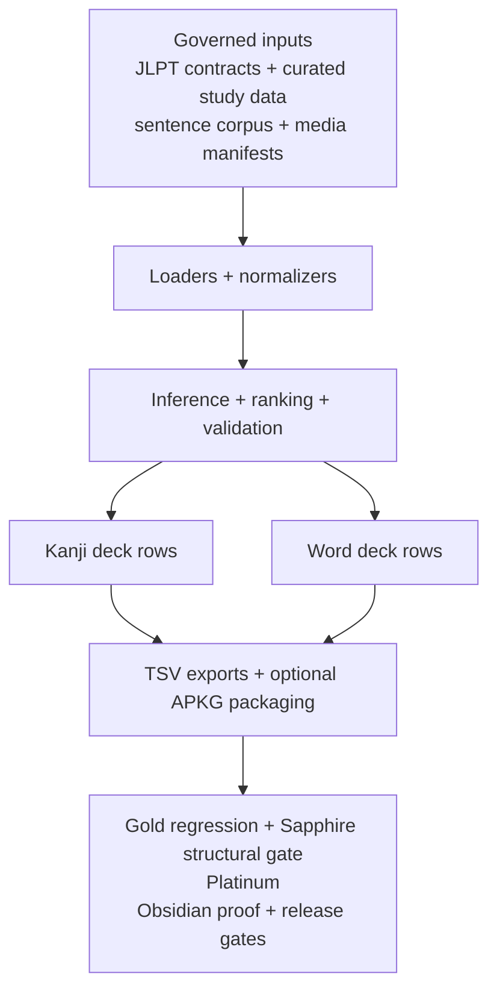
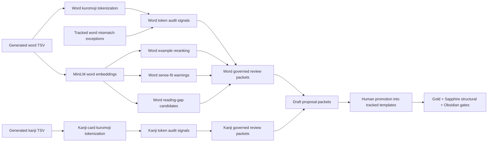

# Japanese Kanji Anki Builder

Japanese Kanji Anki Builder is a governed data pipeline and release-controlled content generation system for JLPT kanji and vocabulary. Its user-facing output is Anki study material, but the core program is the machinery that turns curated source data, media policy, review contracts, and proof ledgers into deterministic TSV exports and optional `.apkg` packages.

Run this first:

```bash
npm run doctor
```

Kanji cards and word cards are separate learning products. A kanji card teaches one target kanji. A word card teaches one exact written form and reading, such as `学校|がっこう`.

## Purpose

This repository is built for controlled output, not casual scrape-and-export deck generation. In employer-facing terms, it is a release-controlled content generation system with deck exports as one governed artifact.

- Tracked JSON contracts define JLPT kanji inventory, word eligibility, Anki note fields, media policy, review expectations, and source-evidence rules.
- Ignored local files under `data/`, `downloads/`, and `out/` are workspace inputs or generated artifacts. They are not product truth unless promoted into tracked contracts.
- Gold regression, Sapphire structural gates, Platinum, Obsidian rereview proof, source-governance audits, and release QA are separate checks. A pass in one layer does not imply a pass in the others.
- Build scripts produce deterministic TSV exports and byte-stable optional `.apkg` packages from unchanged packaged inputs.

## Scope

- JLPT kanji decks from N5 through N1.
- JLPT word decks by exact written form and reading.
- Curated learner-facing readings, meanings, examples, notes, pitch accent, audio, and stroke-order media.
- Governed source evidence for JLPT kanji taxonomy and word-card field review.
- Offline-safe preview, review, build, package, audit, and release-gate commands.

## Reviewer Entry Points

- [docs/employer-overview.md](docs/employer-overview.md): a fast, evidence-backed summary of what the project proves today and what remains intentionally unfinished.
- [docs/system-architecture.md](docs/system-architecture.md): a visual architecture map for the input, normalization, generated-surface, review, proof, and release layers.

## Authority Boundary

This README is an orientation and routing document. It does not certify release readiness, current hosted GitHub settings, source-evidence completion, APKG import, mobile behavior, accessibility, listening quality, managed-media QA, or ignored local input quality by itself.

Current truth comes from the tracked contracts, live commands, generated reports, hosted audits, and manual evidence packets named in the relevant section. Treat every count and status here as an orientation snapshot; rerun the named commands before merge, release, source-governance, or deck-quality decisions.

## Quick Start

```bash
npm install
npm run doctor
npm run corpus:init
npm run curated:init
npm run words:init
npm run media:init
npm run deck:ready -- --levels=5
npm run deck:words:ready -- --levels=5
```

Kanji deck readiness requires governed audio and complete exported media fields. A level with missing exact primary-reading audio must not be treated as ready even if the managed manifest inventory reports audio coverage.

Native `.apkg` commands require the Python packaging toolchain. If packaging is blocked on a workstation, use the readiness output and package directory for review, then run `.apkg` packaging in a supported environment before release.

## Security Posture

This repository is a local deck-build tool, not a hosted public service. The Express server has no authentication layer and is intended for local development only. It binds to `127.0.0.1` by default. Set `SERVER_HOST=0.0.0.0` only for a deliberate, temporary, trusted-network workflow.

VOICEVOX should also stay local. The governed Docker helper expects host `127.0.0.1:50021` mapped to Nemo container port `50121` and recreates stale containers that are missing the required runtime hardening: `no-new-privileges`, `cap-drop ALL` with only `SETUID` and `SETGID` restored for the image entrypoint's `gosu` user switch, `--restart no`, Docker `--init`, and explicit memory, CPU, and process-count limits.

Treat ignored workspace inputs under `data/`, `downloads/`, and `out/` as local, review-required material. Do not import untrusted dictionaries, sentence corpora, media, or audio without checking the parser/import path and resulting card surfaces.

See [SECURITY.md](SECURITY.md) for the disclosure policy and threat model. See [docs/supply-chain-security.md](docs/supply-chain-security.md) for dependency, workflow, script, and release-artifact trust boundaries.

Security CI includes dependency review, npm advisory auditing, dependency-license compliance, tracked secret scanning, lockfile-derived CycloneDX SBOM validation, branch-protection policy checks, requirements traceability, SDLC metrics, hostile-input regression tests, and pinned CodeQL analysis for JavaScript/TypeScript plus GitHub Actions workflow code.

Tagged release bundles include a checksum manifest, generated CycloneDX SBOM, generated dependency-license summary, and GitHub artifact attestations for provenance and SBOM binding.

## Review Tiers

These lane names are product gates, not marketing labels. Kanji and word decks run them separately.

The binding forward-lane contract is [docs/review-system-forward-contract.md](docs/review-system-forward-contract.md). The tier summary is [docs/review-tier-governance.md](docs/review-tier-governance.md). The operating contract for Sapphire, Platinum, and Obsidian work is [docs/platinum-obsidian-review-contract.md](docs/platinum-obsidian-review-contract.md). Read them before any Sapphire, Platinum, or Obsidian batch.

| Lane | What it means | What it does not prove |
| --- | --- | --- |
| Silver | A generated card surface exists for the product. | Reviewed content, source truth, release quality, or learner usefulness. |
| Gold | Gold regression protects reviewed generated output from drift. | Source truth, release approval, or substantive current-version rereview. |
| Sapphire | Structural certification: the live generated card passed the governed structural contract for its product, with required field identity, evidence lane separation, required internal check records, media identity fields, required support artifacts such as NLP where the workflow calls for them, explicit limitations, and a keep/fix/defer/remove decision. Core kanji uses native `templates/sapphire_n*_review_set.json` and `deck:sapphire:*`; words use native `templates/sapphire_n*_word_review_set.json` and `deck:words:sapphire:*`; additional surfaces still retain compatibility command names until migrated. | Platinum, source-truth certification, Obsidian proof, human-reviewed provenance, release readiness, or permission to shrink another lane's denominator. |
| Platinum | Card-surface inspection: the actual generated card was reviewed beyond structure for learner-facing reading, meaning, example, notes/support surface, media identity, level/product fit, evidence boundaries, limitations, and final keep/fix/defer/remove judgment under the current Platinum schema. | Obsidian proof, release readiness, human-reviewed provenance, manual APKG/mobile/accessibility/listening QA, or later audits not recorded in the schema. |
| Obsidian | The repository's current non-human governed native/fluent-quality content-certification proof lane for a scoped version. The live card surface is rereviewed for natural Japanese, sense and translation fit, learner usefulness, level fit, reading/example quality, evidence, limitations, and release-quality content. Proof is bound through the canonical proof ledger plus fail-closed certification commands. Kanji proof must include structured rereview provenance and actual example-sentence review evidence. Word proof must include structured rereview provenance, exact word-reading identity binding, a full word-card evidence checklist, and actual example-sentence review evidence. | Human-reviewed provenance for the same native/fluent-quality standard, release artifact QA, APKG/mobile/accessibility/listening approval, or source-taxonomy confidence unless separately recorded. |

Candidate rows, selector output, migration targets, and expansion triage are pre-trust queues. They are useful workflow inputs, but they are not certified gates and do not move trusted denominators.

`Deck Ready`, `Word Deck Ready`, APKG readiness, and package staging are mechanical artifact states, not trust tiers. They do not certify Gold, Sapphire, Platinum, Obsidian, source-governance confidence, release readiness, or manual QA.

### Obsidian, Release QA, And Human Provenance

Obsidian is not "all earlier lanes were green, therefore trust it." It is the separate, evidence-backed native/fluent-quality rereview of the actual live card surface under the repo's governed proof schema. For a scoped version, a passing Obsidian certification gate is the program's current content-certification standard and must check natural Japanese, sense fit, translation quality, learner usefulness, level fit, reading/example quality, evidence, limitations, and release-quality content.

Current Obsidian proof is non-human governed proof. That does not lower the content standard. Future human or native/fluent review is human-reviewed provenance over the same native/fluent-quality standard, not a different content standard.

Release QA starts after that content claim. It proves the packaged artifact can be imported, rendered, listened to, inspected for accessibility, and distributed with the recorded source and media boundaries. Release QA is not a second content-certification lane. If release QA reveals a content defect, reopen Sapphire, Platinum, and Obsidian for the affected cards, then rerun the gates.

## Current Baseline

Run live commands for release decisions. This section is an orientation snapshot, not the release gate. Commits that change review counts, proof posture, or readiness posture must update the affected README, docs, and changelog lines in the same commit.

All five JLPT levels are first-class product surfaces. N5/N4/N3/N2 kanji are Obsidian certified; N1 is currently a trusted-reset lane with native governed Sapphire batching restarted and no Obsidian certification counted. Sapphire structural coverage and Platinum are separate lanes. Existing `platinum_n*_review_set.json` manifests remain the tracked Platinum inputs until a deliberate count-preserving migration changes that contract.

### Kanji Product

| Surface | Current state | Main gates |
| --- | --- | --- |
| N5 kanji | `80/80` Obsidian-certified. Generated surface, media/readiness, and lower-lane prerequisites are complete for the scoped card identities. | `deck:kanji:obsidian:certify-status -- --levels=5`, `deck:ready -- --levels=5` |
| N4 kanji | `212/212` Obsidian-certified. Generated surface, media/readiness, and lower-lane prerequisites are complete for the scoped card identities. | `deck:kanji:obsidian:rereview-status -- --levels=5,4`, `deck:kanji:obsidian:certify-status -- --levels=4`, `deck:ready -- --levels=4` |
| N3 kanji | `341/341` Obsidian-certified. Generated surface, media/readiness, and lower-lane prerequisites are complete for the scoped card identities. | `deck:kanji:obsidian:rereview-status -- --levels=3`, `deck:kanji:obsidian:certify-status -- --levels=3`, `deck:ready -- --levels=3` |
| N2 kanji | `349/349` Obsidian-certified with `0` remaining and `0` blocked/failing. Generated surface, media/readiness, and lower-lane prerequisites are complete for the scoped card identities. | `deck:kanji:obsidian:rereview-status -- --levels=2`, `deck:kanji:obsidian:certify-status -- --levels=2`, `deck:ready -- --levels=2` |
| N1 kanji | `1230/1230` generated and Gold; trusted current-standard native Sapphire structural coverage is `328/1230`; current-standard Platinum card-surface inspection is `328/1230`; trusted Obsidian proof remains `0/1230`; and `902` generated rows still require fresh actual card-data Sapphire and Platinum review before any Obsidian proof is recorded. | `deck:kanji:review-status`, `deck:ready -- --levels=1`, `deck:sapphire:n1`, `deck:sapphire:batch -- --level=1 --limit=8 --queue=missing-current-standard`, `deck:platinum:n1`, `deck:platinum:batch -- --level=1 --limit=8 --queue=missing-current-standard` |
| Additional kanji diagnostic | `0` physical additional cards. `398` additional source claims are governed and suppressed because they collide with `387` core-retained source-claim kanji; unresolved duplicates are `0`. | `deck:kanji:additional:ready`, `deck:kanji:review-status` |

`deck:ready` currently reports N5 through N1 kanji as ready with `100.0%` of mechanical readiness checks passing for sentence, curated, stroke-order, required media, readings, meanings, examples, and contextual notes. For N1, this is not content trust, Sapphire coverage, Platinum, Obsidian certification, or release approval.

Full-level media completeness is owned by `deck:ready -- --levels=<level>` plus the media policy audits. `media:review:audio` is only scoped card-level audio identity/listening evidence for the cards under review; it must never be reported as full-level media coverage or used to shrink the media denominator.

Core kanji Sapphire coverage currently uses `kanji-sapphire-v1-evidence-lanes`. Only current-standard `sapphire` and `fixed_then_sapphire` entries count as active core-kanji structural coverage after actual card-data review. Core kanji Platinum currently uses `kanji-platinum-v3-evidence-lanes`; only current-standard `platinum` and `fixed_then_platinum` entries count as active Platinum coverage.

`deck:kanji:obsidian:rereview-status -- --levels=5,4,3,2` currently reports N5/N4/N3/N2 kanji as `982/982` Platinum, `982/982` Obsidian, `0/982` needing Obsidian, and `0/982` blocked/failing.

`deck:kanji:obsidian:certify-status -- --levels=5,4,3,2` is the fail-closed kanji Obsidian gate for the completed N5/N4/N3/N2 denominator and currently passes.

For scoped canonical kanji proof levels (N5/N4/N3/N2), switched kanji proof consumers read canonical JSONL Obsidian proof from `templates/obsidian_proof_ledger/*.jsonl`; tracked review-set JSON no longer carries inline Obsidian proof objects for those levels. Kanji levels without scoped proof ledgers still fall back through the provider path until their own proof ledgers are deliberately created and gated.

### Word Product

| Surface | Current state | Main gates |
| --- | --- | --- |
| N5 word | `308/646` strict word Obsidian-certified, plus `20` tracked source-only phrase exclusions outside the generated denominator. The 338 remaining current N5 word v2 dictionary-common-pool Silver additions are generated-ready with word audio, pitch, required back-side fields, examples, reading breakdowns, support labels, and readiness, but they have not completed Gold/Sapphire/Platinum/Obsidian. Live readiness is `ready_with_deferred_variants`; reading coverage is `70.6%` (`243/344`). Release artifact QA, accessibility, and listening checks are still required before release-ready product claims. | `deck:words:obsidian:certify-status -- --levels=5`, `deck:words:ready -- --levels=5` |
| N4 word | `700/719` strict word Obsidian-certified. The 19 current N4 word v2 common-word Silver additions are generated-ready with word audio, pitch, required back-side fields, examples, reading breakdowns, support labels, and readiness, but they have not entered Gold/Sapphire/Platinum/Obsidian. Live readiness is `ready_with_deferred_variants`; reading coverage is `76.7%` (`579/755`). Release artifact QA, accessibility, and listening checks are still required before release-ready product claims. | `deck:words:obsidian:certify-status -- --levels=4`, `deck:words:ready -- --levels=5,4` |
| N3 word | `1099` canonical Silver rows build/package at `1099/1099` with audio, pitch, and required back-side fields complete; reading-coverage readiness remains incomplete. The N3 ready run reports reading coverage `87.3%` (`1034/1184`) with N5/N4/N3 support counted. Gold is `1081/1099` current-standard with `18` generated rows still missing Gold; Sapphire is `1038/1099` current-standard with `61` generated rows still missing Sapphire; Platinum remains `8/1099` current-standard with `1091` generated rows still missing Platinum. Obsidian proof is not recorded for N3 words. | `deck:words:ready -- --levels=3`, `deck:words:review:n3`, `deck:words:sapphire:n3`, `deck:words:platinum:n3`, `deck:words:completion:n3`, `deck:words:reading-audit:n3` |
| N2 word | `61` canonical Silver rows build at `61/61` with audio, pitch, and required back-side fields complete; reading-coverage readiness remains incomplete; cumulative reading coverage is `10.3%` (`108/1045`). Gold, Sapphire, Platinum, and Obsidian are not started. | `deck:words:ready -- --levels=2`, `deck:words:completion:n2`, `deck:words:reading-audit:n2` |
| N1 word | `38` canonical Silver rows build at `38/38` with audio, pitch, and required back-side fields complete; reading-coverage readiness remains incomplete; cumulative reading coverage is `2.8%` (`91/3274`). Gold, Sapphire, Platinum, and Obsidian are not started. | `deck:words:ready -- --levels=1`, `deck:words:completion:n1`, `deck:words:reading-audit:n1` |

For curiosity-only cross-level reading analysis, `deck:words:coverage-uplift -- --target-level=N5 --through-level=N1` reports whether harder word decks backfill the selected target level's kanji-reading coverage. Its baseline counts only the target word deck, then layers harder decks down to `--through-level`; it is read-only and does not affect readiness, deferrals, review lanes, data, media, or proof ledgers.

Strict word Obsidian proof covers `1008/1365` current N5/N4 generated word rows: the N5 Obsidian-certified subset is `308/646`, and the N4 Obsidian-certified subset remains `700/719` after the current word v2 common-word Silver additions. Native Sapphire structural coverage and current-standard Platinum card-surface inspection are complete lower-lane prerequisites for the certified subset; the 338 remaining N5 Silver rows and 19 N4 Silver rows must not be described as Gold, Sapphire, Platinum, or Obsidian-certified.

For migrated N5/N4 word proof, the word Obsidian status/certification commands and their older Platinum compatibility aliases read scoped canonical JSONL Obsidian proof from `templates/obsidian_proof_ledger/word_n5.jsonl` and `templates/obsidian_proof_ledger/word_n4.jsonl` through the proof-provider path by default. The tracked N5/N4 word review sets no longer carry inline word `rereviewProvenance`; reconciliation binds the canonical ledger proof back to those tracked entries.

`deck:words:platinum:source-posture -- --levels=5,4` currently inspects `1008` structurally current-standard entries: `129/1008` have independent source families proven, `879/1008` are single-source-family, and `0/1008` are missing governed source evidence.

Single-source entries carry `word_source_independence_not_proven`. Source-family posture is a diagnostic. It is not the rereview selection pool and not substantive Platinum proof.

### Cross-Product Gates

- `deck:words:obsidian:rereview-status -- --levels=5,4` uses generated word rows as the denominator and defaults to canonical JSONL proof for migrated N5/N4 word ledgers. This legacy proof consumer still reports the structural column as Platinum compatibility while native `deck:words:sapphire:*` owns Sapphire coverage. The N5 word `308/646` and N4 word `700/719` Obsidian-certified subsets remain separate from current N5/N4 v2 Silver additions.
- `deck:words:obsidian:certify-status -- --levels=5,4` is the fail-closed word Obsidian gate. It is expected to fail for the current full N5/N4 generated denominator until the 338 remaining N5 and 19 N4 Silver rows complete Gold, Sapphire, Platinum, and Obsidian.
- `deck:platinum:governance-gate` exercises real generated N5/N4 kanji and word rows when ignored local inputs are present. It currently passes with governance warnings for word single-source-family posture, bulk-template or missing card-specific revalidation summaries, marker-only example-quality automation, and zero active verification limitations. Migrated kanji and word Obsidian proof inputs read through the scoped proof-provider path.
- JLPT kanji source evidence is governed separately from deck readiness. The source audit currently passes source-use governance with `--governance-strict` while evidence-depth work remains incomplete.

## Pipeline At A Glance

Tracked inputs are normalized, ranked, validated, reviewed, and exported into separate kanji and word products. Generated rows, review proof, package artifacts, and release claims are intentionally separate.



## Deck Model At A Glance

Kanji decks teach one kanji at a time. The front of a kanji card is only the target kanji. The back teaches that kanji's primary learner-facing reading and meaning, then uses words and sentences as support.

Word decks teach vocabulary by exact written form and reading. A useful word can appear even if it contains harder kanji, but the card must label those kanji instead of pretending they belong to the current level.

Detailed field contracts, sample cards, and TSV examples live in [docs/deck-model.md](docs/deck-model.md). Card curation rules live in [docs/content-style-guide.md](docs/content-style-guide.md).

## Source Of Truth

Tracked contracts define release behavior:

| Area | Primary tracked source |
| --- | --- |
| JLPT kanji taxonomy | [templates/jlpt_level_contract.json](templates/jlpt_level_contract.json) |
| JLPT kanji source evidence | [templates/jlpt_kanji_source_evidence.json](templates/jlpt_kanji_source_evidence.json), [templates/jlpt_kanji_source_evidence/assignments](templates/jlpt_kanji_source_evidence/assignments) |
| JLPT kanji source acquisition | [docs/source-acquisition-register.md](docs/source-acquisition-register.md) |
| JLPT kanji source-input preflight | [templates/jlpt_kanji_source_inputs.json](templates/jlpt_kanji_source_inputs.json) |
| Kanji reading reference | [templates/kanji_reading_reference_contract.json](templates/kanji_reading_reference_contract.json) |
| Kanji card field source contracts | [templates/kanji_card_field_source_contract.json](templates/kanji_card_field_source_contract.json), [templates/kanji_card_field_source_contracts](templates/kanji_card_field_source_contracts) |
| JLPT word taxonomy | [templates/jlpt_word_level_contract.json](templates/jlpt_word_level_contract.json) |
| Audio source policy | [templates/audio_source_policy.json](templates/audio_source_policy.json) |
| Kanji note schema | [src/config/ankiNoteSchema.json](src/config/ankiNoteSchema.json) |
| Word note schema | [src/config/ankiWordNoteSchema.json](src/config/ankiWordNoteSchema.json) |
| Gold kanji regression sets | `templates/golden_n*_review_set.json` |
| Gold word regression sets | `templates/golden_n*_word_review_set.json` |
| Forward review-lane contract | [docs/review-system-forward-contract.md](docs/review-system-forward-contract.md) |
| Review tier governance | [docs/review-tier-governance.md](docs/review-tier-governance.md) |
| Platinum and Obsidian review contract | [docs/platinum-obsidian-review-contract.md](docs/platinum-obsidian-review-contract.md) |
| Platinum policy | [docs/platinum-review-policy.md](docs/platinum-review-policy.md) |
| Sapphire kanji review sets | `templates/sapphire_n*_review_set.json` |
| Platinum kanji review sets | `templates/platinum_n*_review_set.json` |
| Sapphire word review sets | `templates/sapphire_n*_word_review_set.json` |
| Platinum word review sets | `templates/platinum_n*_word_review_set.json` |
| Platinum card-source roles | [templates/platinum_card_source_manifest.json](templates/platinum_card_source_manifest.json) |
| Word source manifest | [templates/word_source_manifest.json](templates/word_source_manifest.json) |
| Word expansion signal config | [templates/word_expansion_signal_sources.json](templates/word_expansion_signal_sources.json) |
| Assistive NLP model/runtime manifest | [templates/nlp_model_manifest.json](templates/nlp_model_manifest.json) |
| Assistive NLP tokenizer exceptions | [templates/nlp_word_tokenization_mismatch_exceptions.json](templates/nlp_word_tokenization_mismatch_exceptions.json) |

Word source lanes currently include active ignored-local JMdict dictionary verification plus JMdict priority/commonness support. `jpdb-frequency` remains blocked pending permission/governed export.

## JLPT Kanji Source Evidence At A Glance

The source-evidence manifest is the governed source registry: [templates/jlpt_kanji_source_evidence.json](templates/jlpt_kanji_source_evidence.json). The current JLPT kanji contract is an operational comparator, not final source truth, and no source lane can move kanji, move words, update decks, or change readiness by itself.

Reviewer evidence is loaded as source-centric `assignments[sourceId][kanji]` rows and stored in routed per-source assignment files. The materialized `kanji` rollup is derived summary state. It intentionally keeps only level/review-status facts plus computed consensus, agreement, confidence, and notes so reviewer citations are not duplicated across the manifest.

Manifest status is a lifecycle gate. `planned` means registered but not active, `in_review` means manual review or source-input preparation is underway, `active` means the lane may be imported and counted according to governed use, and `blocked` means it must not enter consensus.

| Source lane | Source / location | Current use |
| --- | --- | --- |
| `current_operational_contract` | [Tracked JLPT kanji contract](templates/jlpt_level_contract.json) | Active non-voting comparator for the current operational taxonomy |
| `tanos_legacy_direct` | [Tanos JLPT direct legacy resources](https://www.tanos.co.uk/jlpt/sharing/) | Active approved bulk-import assignment evidence for direct legacy N1, N4, and N5 mappings |
| `tanos_estimated_split` | [Tanos estimated N2/N3 resources](https://www.tanos.co.uk/jlpt/sharing/) | Active approved lower-weight assignment evidence for estimated N2/N3 splits; cannot settle taxonomy movement alone |
| `tanos_frequency_method_notes` | [Tanos sharing/method notes](https://www.tanos.co.uk/jlpt/sharing/) | Active non-voting methodology lane explaining why Tanos N2/N3 evidence is estimated |
| `kanjidic2_legacy` | [KANJIDIC2 legacy JLPT metadata](https://www.edrdg.org/wiki/KANJIDIC_Project.html) | Active approved bulk-import assignment evidence; current pinned rows are exact N1/N4/N5 only, with old JLPT 2 preserved as N2/N3 range evidence when present |
| `official_jlpt_sample_workbooks` | [Official JLPT sample questions/workbooks](https://www.jlpt.jp/e/samples/sampleindex.html?mode=pc-5) | Active occurrence-only evidence; stores only source PDF, section/page/question reference, and observed kanji |
| `japanese_textbook_consensus` | Derived from individual textbook lanes in the source manifest | Active non-voting derived summary; never manually imported as a copied list |
| `ask_hajimete_jlpt_kanji` | [ASK Hajimete JLPT kanji books](https://ask-books.com/series/jlpt-kanji/) | Active restricted manual-citation textbook lane with `208` reviewed assignments, `0` source_access_gap rows, and `0` pending rows; N4 remains unsupported until exact assignment proof is verified |
| `jlptsensei` | [JLPT Sensei kanji lists](https://jlptsensei.com/) | Planned secondary non-Japanese manual-citation signal; inactive/non-voting until reviewed rows are pinned and source activated; do not scrape, copy, or republish lists |
| `shin_kanzen_master_kanji` | [Shin Kanzen Master textbooks](https://www.3anet.co.jp/np/en/list.html?series_id=4) | Active restricted manual-citation assignment lane with `406` reviewed assignments, `236` source_access_gap rows, and `1570` pending rows |
| `nihongo_sou_matome_kanji` | [Nihongo Sou Matome textbooks](https://www.ask-books.com/jp/somatome/) | Active restricted manual-citation textbook lane with `442` reviewed assignments, `473` source_access_gap rows, and `1297` pending rows; pause broad review until fuller exact assignment access or targeted citations are available |
| `try_jlpt_textbook` | [TRY! JLPT textbooks](https://ask-books.com/jlpt-try) | Blocked unless exact per-kanji assignment proof is found; public TRY materials expose grammar/vocabulary surfaces, not exact per-kanji assignment proof |
| `joyo_grade` | [Agency for Cultural Affairs Joyo kanji index](https://www.bunka.go.jp/seisaku/kokugo_nihongo/kokugo_shisaku/joyokanjihyo_sakuin/index.html) | Planned official background metadata only; not JLPT assignment proof |
| `bccwj_frequency` | [BCCWJ frequency lists](https://clrd.ninjal.ac.jp/bccwj/en/freq-list.html) | Planned frequency sanity only; not assignment truth |
| `kanji_alive` | [Kanji Alive credits/data policy](https://kanjialive.com/credits/) | Planned learner/background metadata only; not JLPT assignment proof |
| `jpdb` | [jpdb kanji metadata](https://jpdb.io/) | Planned restricted manual frequency sanity only after source-use review; no automated extraction, raw data storage, assignment truth, or consensus voting |
| `kanshudo` | [Kanshudo terms](https://www.kanshudo.com/tc) | Planned restricted lane; blocked until express permission/license and a governed use path are approved |
| `wanikani` | [WaniKani terms](https://www.wanikani.com/terms) | Planned restricted lane; blocked until source-use/API/export terms and a governed use path are approved |

Tanos direct legacy and KANJIDIC2 legacy have different publisher-independence groups but share the `pre_2010_direct_jlpt` evidence lineage. They do not satisfy the independent-lineage requirement by themselves.

## Product Rules

Kanji decks:

- Each shipped kanji belongs to the tracked JLPT kanji contract.
- The JLPT kanji contract is the current operational taxonomy, not sole source truth.
- Non-disputed source consensus can be promoted only by an explicit governed contract migration.
- The kanji deck learning target is the individual kanji.
- `DisplayWord` is the target kanji itself.
- `PrimaryReading` is the most learner-useful, level-appropriate reading for that kanji.
- Compound words belong in notes, examples, and word decks; they must not replace the kanji-card anchor.
- Audio is governed by policy and required for kanji deck readiness.
- Additional kanji is currently a source-claim diagnostic with `0` physical cards, not an extra learner backlog.

Word decks:

- Word identity is `written|reading`.
- The canonical word contract means default-deck eligible.
- Source-only phrase exclusions stay tracked but do not ship as default word cards.
- A word is anchored by kanji from its own deck level. Other constituent kanji are support kanji and must be visibly labeled.
- A word must not ship in an easier/higher-numbered deck when it has no current-level anchor and depends only on harder support kanji.
- Outside-JLPT constituent kanji do not choose the JLPT deck level, but they must be visibly labeled.
- Reading coverage is scoped to the selected word-product levels.
- Expansion triage is routing only. A word moves only when the target level's word contract and starter data are updated and pass that level's gates.
- Sentence orthography review is advisory. It flags likely kana-only regressions without banning natural kana usage.

Review layers:

- Candidate rows, selector results, source rows, migration targets, and triage queues are pre-trust workflow inputs. They are not certification gates and do not move trusted denominators.
- Gold regression protects reviewed generated output from drift. It does not mean release approval.
- Sapphire gates current structural requirements against live generated rows. Core kanji uses native `deck:sapphire:*`; words use native `deck:words:sapphire:*`; additional surfaces still retain compatibility names until migrated.
- Platinum gates current card-surface inspection against live generated rows. Core kanji uses `deck:platinum:*`; words use `deck:words:platinum:*`.
- Obsidian certification requires explicit non-mechanical current-version rereview proof and is the repo's current non-human governed native/fluent-quality content-certification lane for the scoped version.
- Core-kanji Sapphire entries before `kanji-sapphire-v1-evidence-lanes`, and word Sapphire entries before `word-sapphire-v1-evidence-lanes`, are legacy history until revalidated.
- Use the [Obsidian batch workflow](docs/obsidian-batch-workflow.md) for review batches. Run status, batch, generated-surface refresh, NLP support, governed rereview, canonical JSONL proof append via `data:obsidian:proof:append`, structural/reading verification, and progress checks during the work; run the fail-closed certification gate only when the selected scope is expected to be fully Obsidian.

## Failure Semantics

Expected backlog failures must stay visible and scoped. Incomplete N1 current-standard Sapphire and Obsidian coverage, incomplete N3/N2/N1 word readiness, source-evidence depth gaps, missing release QA evidence, and unproven post-attestation release verification are not clean states, but they are different from regressions in completed scopes.

Blockers require a fix, a rerun, or an explicit accepted-risk record before release-facing claims. Examples include a fail-closed certification failure for a completed denominator, a hosted security alert that is open without accepted-risk documentation, a source lane promoted beyond its permitted evidence posture, a local-data-only gate reported as CI truth, or manual APKG/mobile/accessibility/listening QA being treated as proven by automated tests.

Diagnostic passes do not certify unrelated lanes. Source-use governance, NLP governance, generated-row readiness, Gold regression, Sapphire structural coverage, Platinum, Obsidian proof, media completeness, hosted security posture, release trust, and manual product QA each keep their own denominator and command evidence.

For end-of-batch handoff, run `npm run deck:closeout -- --levels=<levels>`. It preserves the Silver/Gold/Sapphire/Platinum/Obsidian lane order by printing git state, a lower-lane Silver/Gold/Sapphire/Platinum count matrix, count-complete gate reminders, expected coverage-failure gates, NLP support posture, CI/release/manual-QA reminders, and proof-ledger worktree status. Count-complete rows mean "run the named gate to confirm," not actual gate-pass proof. It is read-only: it does not run Obsidian status commands, append proof, listen to audio, import APKGs, or certify release readiness.

## Core Workflows

Use [docs/workflows.md](docs/workflows.md) for complete workflow details.

High-value entry points:

```bash
npm run doctor
npm run deck:readiness
npm run deck:ready -- --levels=5
npm run deck:words:ready -- --levels=5,4
npm run deck:kanji:review-status
npm run deck:words:obsidian:rereview-status -- --levels=5,4
npm run deck:words:platinum:source-posture -- --levels=5,4
npm run deck:platinum:governance-gate
```

Media and audio entry points:

```bash
npm run media:plan -- --level=5 --limit=25
npm run media:sync -- --level=5 --limit=25
npm run voicevox:status
npm run voicevox:start
npm run media:voicevox:words -- --level=5 --speaker-id=10005 --concurrency=4
npm run media:review:word-audio -- --level=5 --limit=25
npm run data:audit:audio -- --json
```

## Verification And Release

Use [docs/verification.md](docs/verification.md) for the full verification bundle and gate explanations. Use [docs/release-process.md](docs/release-process.md), [docs/release-qa-checklist.md](docs/release-qa-checklist.md), and [docs/product-exit-criteria.md](docs/product-exit-criteria.md) before product release claims.

Minimum local engineering checks:

```bash
npm test
npm run lint
npm run typecheck
npm run supply-chain:audit
npm run security:licenses
npm run security:requirements
npm run security:sdlc-metrics
npm run release:gate
```

Clean CI runs `security:licenses`, `security:requirements`, `security:sdlc-metrics`, `data:obsidian:proof:validate`, `data:obsidian:proof:reconcile -- --levels=5,4,3,2`, `data:obsidian:proof:reconcile -- --deck-kind=word --levels=5,4`, `data:obsidian:proof:provider-parity -- --levels=5,4,3,2 --row-source=tracked-review-set`, `data:obsidian:proof:provider-parity -- --consumer=kanji-batch-report --levels=5,4,3,2 --queue=substantive-rereview --limit=8 --row-source=tracked-review-set`, `data:obsidian:proof:provider-parity -- --consumer=kanji-platinum-level --levels=5,4,3,2 --row-source=tracked-review-set`, `data:obsidian:proof:provider-parity -- --consumer=kanji-field-source-contract --levels=5,4,3,2 --row-source=tracked-review-set`, `data:obsidian:proof:provider-parity -- --consumer=platinum-governance-gate --levels=5,4,3,2 --row-source=tracked-review-set`, `data:obsidian:proof:provider-parity -- --consumer=word-rereview-status --deck-kind=word --levels=5,4 --row-source=tracked-review-set`, `data:obsidian:proof:provider-parity -- --consumer=word-certify-status --deck-kind=word --levels=5,4 --row-source=tracked-review-set`, `data:obsidian:proof:provider-parity -- --consumer=word-batch-report --deck-kind=word --levels=5,4 --queue=substantive-rereview --limit=8 --row-source=tracked-review-set`, `data:obsidian:proof:provider-parity -- --consumer=word-platinum-level --deck-kind=word --levels=5,4 --row-source=tracked-review-set`, `data:obsidian:proof:provider-parity -- --consumer=word-governance-inputs --deck-kind=word --levels=5,4 --row-source=tracked-review-set`, `perf:memory:matrix`, `data:audit:jlpt -- --strict --tracked-only`, `data:audit:jlpt:sources -- --governance-strict --limit=25`, `data:audit:jlpt:words`, and `deck:words:platinum:source-posture -- --levels=5,4` from tracked inputs.

Clean CI does not run `deck:platinum:governance-gate` or generated-row Obsidian proof-provider parity because those commands exercise ignored local `data/*` real generated-row inputs. Run them in a local-data workspace before release claims that depend on current generated kanji or word rows.

Tracked CI tests must not read ignored root `data/*` inputs. Use tracked contracts, tracked fixtures, or explicit temp fixtures in CI. The tracked KANJIDIC2 reading contract is a `kanji-reading-reference` lane only; exact kanji primary-reading checks against generated `OnReading`/`KunReading` remain in local generated-row Sapphire gates. The tracked N5/N4/N3 kanji card-field source contracts are a `kanji-field-verification` lane extracted from current-standard Sapphire `japanese-source` evidence; they are not JLPT placement evidence, generated TSV evidence, Obsidian proof, or release readiness by themselves.

Benchmark budget commands are manual/local performance guardrails, not GitHub Actions CI gates. `data:benchmark:jlpt:sources:gate`, `bench:obsidian-proof-etl:gate`, `bench:build:gate`, and `bench:build:cold-apkg:gate` are manual/local performance guardrails for source-evidence, Obsidian proof ETL, hot-cache build, and cold native APKG package-performance changes. `bench:build:gate` runs a warmup before the measured hot-cache build, and `bench:build:cold-apkg:gate` clears the generated APKG cache and gates the cold package phase only; the hot build gate owns total/export/media-sync budgets. Both build gates require a ready local workspace and write benchmark output under the configured benchmark output directory. Before changing timing budgets or claiming a close run is stable, run the benchmark standalone, append `-- --repeat=3` to the relevant command, and keep the same machine, runtime, cache mode, and input boundary. `perf:memory:matrix` is a CI-safe metadata audit, not a timing budget gate, and memory thresholds remain trend-only until repeated samples justify a hard limit.

Release process:

- Follow [docs/release-process.md](docs/release-process.md).
- Keep [CHANGELOG.md](CHANGELOG.md) current.
- Use `v<package.json version>` tags.
- Keep [NOTICE.md](NOTICE.md) current for shipped attribution.

License boundary:

- Repository code is licensed under [ISC](LICENSE), matching `package.json`.
- Generated decks, media, dictionary-derived fields, pitch data, and source-evidence artifacts can carry separate source, CC BY-SA, VOICEVOX, or attribution obligations. Treat [NOTICE.md](NOTICE.md), source manifests, and release QA evidence as the product-distribution boundary.

Repository governance:

- [docs/branch-protection.md](docs/branch-protection.md)
- [.github/CODEOWNERS](.github/CODEOWNERS)
- [CLAUDE.md](CLAUDE.md)

## Assistive NLP Review Engine

NLP is not a new certification path. It is a governed review-amplification layer between generated card output and human promotion. It helps find likely issues, candidate improvements, and review priorities before or during Obsidian rereview. It cannot certify cards, write tracked templates, approve source truth, approve Gold/Sapphire/Platinum/Obsidian, or claim release readiness.

The repository has two deliberately different governed NLP lanes:

- word tokenization and tokenizer/card-reading mismatch context
- word embeddings, example reranking, sense-fit warnings, and reading-gap candidates
- word governed review packets and draft-proposal scaffolds
- kanji-card tokenization signals and kanji-scoped review packets

Word decks use the broad model-backed lane. First generate live word rows with the normal word build, then run `deck:words:expansion-support -- --levels=<levels>`. That support command runs model/runtime checks, tokenization, embeddings, example reranking, sense-fit warnings, reading-gap candidate discovery, review packets, draft proposals, artifact validation, and `nlp:governance-gate`. Review packets point the Obsidian pass at exact word-reading targets, tokenizer issues, example alternatives, sense-fit risks, and candidate words. The Obsidian pass still inspects the actual generated row and tracked evidence. If NLP exposes a real issue, fix tracked source/card data first, regenerate, rerun relevant gates, and rerun NLP if the affected support artifact changed. Certification remains only through `deck:words:obsidian:rereview-status` and `deck:words:obsidian:certify-status`.

Kanji decks use the narrower kanji-card signal lane. First generate or refresh the kanji TSV with the normal kanji build, then run `deck:kanji:nlp-signals -- --levels=<levels>`. That support command audits the NLP manifest/runtime, refreshes generated kanji TSVs, tokenizes bare kanji-card anchors, creates kanji-scoped review packets and draft notes, validates artifacts, and runs `nlp:governance-gate`. It does not run word expansion, word reading-gap discovery, word example reranking, word sense-fit audits, or word-card embeddings. Kanji tokenizer differences are usually reading variants or tokenizer coverage gaps, not automatic defects, because one bare kanji can legitimately have multiple readings. Certification remains only through `deck:kanji:obsidian:rereview-status` and `deck:kanji:obsidian:certify-status`.

A clean NLP packet is not Obsidian. A passing NLP gate is not Obsidian. A draft proposal is not Obsidian. Obsidian means the current non-human governed rereview used the live generated card plus tracked evidence, considered any NLP signals as support context, checked native/fluent-quality content criteria, fixed any real issue, and recorded structured non-mechanical rereview proof. Future human/native review records human-reviewed provenance for the same standard. Word proof must bind exact written+reading identity and include the full word-card checklist. Kanji proof must bind the card identity and include actual example-sentence quality review evidence.



Primary NLP commands:

```bash
npm run deck:words:expansion-support -- --levels=5,4,3,2,1
npm run deck:kanji:nlp-signals -- --levels=5,4,3,2,1
npm run nlp:governance-gate
```

Full operating rules live in [docs/nlp-model-governance.md](docs/nlp-model-governance.md). Generated NLP artifacts stay under ignored output directories such as `out/nlp-tokenization/`, `out/nlp-embeddings/`, `out/nlp-suggestions/`, `out/nlp-review-packets/`, and `out/nlp-drafts/`.

## Documentation Map

| Need | Read |
| --- | --- |
| Documentation governance and schema | [docs/documentation-standard.md](docs/documentation-standard.md) |
| Card field contracts and examples | [docs/deck-model.md](docs/deck-model.md) |
| Card curation style | [docs/content-style-guide.md](docs/content-style-guide.md) |
| Common local workflows | [docs/workflows.md](docs/workflows.md) |
| Full command list | [docs/command-reference.md](docs/command-reference.md) |
| Verification gates | [docs/verification.md](docs/verification.md) |
| SDLC gap audit | [docs/software-development-life-cycle-audit.md](docs/software-development-life-cycle-audit.md) |
| Hosted GitHub security settings | [docs/github-repository-settings-checklist.md](docs/github-repository-settings-checklist.md) |
| Threat model | [docs/threat-model.md](docs/threat-model.md) |
| Risk and exception register | [docs/risk-register.md](docs/risk-register.md) |
| Security training checklist | [docs/security-training-checklist.md](docs/security-training-checklist.md) |
| Incident response | [docs/incident-response.md](docs/incident-response.md) |
| Recovery and rollback | [docs/recovery-and-rollback.md](docs/recovery-and-rollback.md) |
| Release bar | [docs/product-exit-criteria.md](docs/product-exit-criteria.md), [docs/release-process.md](docs/release-process.md), [docs/release-qa-checklist.md](docs/release-qa-checklist.md) |
| Forward review-lane contract | [docs/review-system-forward-contract.md](docs/review-system-forward-contract.md) |
| Review tier governance | [docs/review-tier-governance.md](docs/review-tier-governance.md) |
| Platinum and Obsidian operating contract | [docs/platinum-obsidian-review-contract.md](docs/platinum-obsidian-review-contract.md) |
| Card-quality review policy | [docs/platinum-review-policy.md](docs/platinum-review-policy.md) |
| Source-evidence workflow | [docs/source-evidence-batching.md](docs/source-evidence-batching.md), [docs/source-acquisition-register.md](docs/source-acquisition-register.md) |
| Dependency and artifact trust boundaries | [docs/supply-chain-security.md](docs/supply-chain-security.md) |
| Platform compatibility | [docs/compatibility-matrix.md](docs/compatibility-matrix.md) |

## Update Triggers

Update this README in the same commit when product counts, review-tier posture, gate names, source-evidence lane status, release blockers, security posture, workflow entry points, local-data boundaries, source-of-truth paths, or documentation-map entries change.

Run `npm run docs:status-audit` whenever README, CHANGELOG, CLAUDE, workflow, command-reference, verification, architecture, or overview language changes product counts, review posture, command routing, or Silver/Gold/Sapphire/Platinum/Obsidian lane-boundary claims.

README changes that alter release-facing posture also require the relevant deeper doc and [CHANGELOG.md](CHANGELOG.md) line to move with them. Do not preserve stale status language here if the live command, tracked manifest, hosted audit, or manual evidence packet no longer supports it.

## Local Data And Outputs

Expected ignored workspace data:

- `data/kanji_jlpt_only.json`
- `data/KRADFILE` as a local fallback only; governed deck builds prefer [templates/kanji_component_contract.json](templates/kanji_component_contract.json)
- `data/sentence_corpus.json`
- `data/curated_study_data.json`
- `data/word_study_data.json`

`data/kanji_jlpt_only.json` is ignored runtime input, not source truth. Deck-facing loaders guard it against the tracked JLPT level contract; audit and sync commands intentionally read it unguarded so they can report or repair drift.

Tracked tests must not make `data/kanji_jlpt_only.json` or any other ignored root `data/*` file a CI source of truth. Local generated-row Sapphire structural gates and Platinum gates may use these ignored inputs to validate the live workstation build, but tracked CI truth must come from governed contracts or fixtures.

Managed media:

- `data/media/`

Media source folders:

- `data/media_sources/stroke-order/images/`
- `data/media_sources/stroke-order/animations/`
- `data/media_sources/audio/`

Optional `.env` settings:

- `NODE_ENV`
- `SERVER_HOST` (defaults to `127.0.0.1`; set `0.0.0.0` only for an intentional LAN-exposed dev server)
- `WORD_STUDY_DATA_PATH`
- `VOICEVOX_ENGINE_URL`
- `VOICEVOX_SPEAKER_ID`
- `REMOTE_STROKE_ORDER_IMAGE_BASE_URL`
- `REMOTE_STROKE_ORDER_ANIMATION_BASE_URL`
- `REMOTE_STROKE_ORDER_ANIMCJK_BASE_URL`
- `REMOTE_AUDIO_BASE_URL`
- `MEDIA_MANIFEST_CACHE_TTL_MS`

Kanji build artifacts:

- `out/build/exports/`
- `out/build/reports/`
- `out/build/build-summary.json`
- `out/build/package/`

Word build artifacts:

- `out/word-build/exports/`
- `out/word-build/reports/`
- `out/word-build/build-summary.json`
- `out/word-build/package/`

Shared generated package cache:

- `out/.apkg-cache/`
