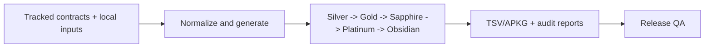

# Japanese Kanji Anki Builder

Japanese Kanji Anki Builder is a governed pipeline for turning curated Japanese data, review contracts, media policy, and proof ledgers into deterministic kanji and word Anki exports.

Run this first:

```bash
npm run doctor
```

Kanji cards teach one target kanji. Word cards teach one exact `written|reading` identity.

## Purpose

This repository is for controlled output, not casual scrape-and-export deck generation. Tracked contracts, local inputs, deterministic builders, review lanes, proof ledgers, and release gates are separate parts of that control.

## Scope

- JLPT kanji decks for N5 through N1.
- JLPT word decks keyed by exact written form and reading.
- Learner-facing readings, meanings, examples, notes, pitch, audio, and stroke-order media.
- Offline-safe preview, review, build, package, audit, and release-gate commands.

## Authority Boundary

This README is an orientation and routing document. It does not certify release readiness, hosted GitHub settings, source-evidence completion, APKG import, mobile behavior, accessibility, listening quality, managed-media QA, or ignored local input quality.

Tracked contracts, live commands, generated reports, hosted audits, and release evidence packets are authoritative. Treat every count and status here as an orientation snapshot; rerun the named commands before merge, release, source-governance, or deck-quality decisions.

## Current Release Target

`v0.3.0-beta.5` is the current published N5-only automation-reviewed prerelease containing the core N5 kanji and core N5 word APKGs. It excludes every other level and additional-unverified kanji. The required public label is `AUTOMATION-REVIEWED PREVIEW - HUMAN DEVICE QA NOT PERFORMED`. Published `v0.3.0-beta.4` remains its immutable predecessor; the earlier `v0.3.0-beta.1`, `v0.3.0-beta.2`, and `v0.3.0-beta.3` tags failed closed before publication and are retained only as immutable failure evidence.

All available automated content, source, media, APKG-structure, packaged full-level Golden regression, security, checksum, SBOM, provenance, and attestation controls remain mandatory. Desktop/mobile native import, interactive screen-reader, listening/naturalness, and stroke-sequence visual review are not available for this preview and are explicitly accepted—not claimed as passed—under `PROD-REL-001`. See [the exact release scope](docs/releases/v0.3.0-beta.5-n5-automation-preview.md).

## Quick Start

```bash
npm install
npm run doctor
npm run corpus:init
npm run curated:init
npm run words:init
npm run media:init
npm run deck:ready -- --levels=5
npm run deck:words:ready -- --levels=5
```

Use `data/README.md` for local-data setup. Native `.apkg` packaging also requires the supported Python packaging toolchain.

## Security Posture

The Express server and VOICEVOX are local-only by default. The server binds to `127.0.0.1`; use `SERVER_HOST=0.0.0.0` only for a deliberate trusted-network session. The governed VOICEVOX shape is host `127.0.0.1:50021` to container port `50121`, with the documented Docker hardening.

Treat ignored `data/`, `downloads/`, and `out/` content as local, review-required material. See [SECURITY.md](SECURITY.md), [docs/threat-model.md](docs/threat-model.md), and [docs/supply-chain-security.md](docs/supply-chain-security.md).

## Review Tiers

Kanji and word decks run them separately. The binding contract is [docs/review-system-forward-contract.md](docs/review-system-forward-contract.md); the tier summary is [docs/review-tier-governance.md](docs/review-tier-governance.md). Read [docs/platinum-obsidian-review-contract.md](docs/platinum-obsidian-review-contract.md) before Sapphire, Platinum, or Obsidian work.

| Lane | Meaning | Does not prove |
| --- | --- | --- |
| Silver | A generated card surface exists. | Reviewed content, source truth, or release quality. |
| Gold | Regression protects reviewed generated output from drift. | Source truth, Sapphire, Platinum, Obsidian, or release approval. |
| Sapphire | Current-standard structural certification for the live generated card. Core kanji uses native `templates/sapphire_n*_review_set.json` and `deck:sapphire:*`; words use native `templates/sapphire_n*_word_review_set.json` and `deck:words:sapphire:*`; additional surfaces still retain compatibility command names. | Platinum, source-truth certification, Obsidian proof, human-reviewed provenance, or release readiness. |
| Platinum | Card-surface inspection: review the live learner-facing surface beyond structure under the current Platinum schema. | Obsidian proof, release readiness, or manual package/device QA. |
| Obsidian | Current non-human governed native/fluent-quality content-certification proof for the scoped version. | Human-reviewed provenance, release QA, or source-taxonomy confidence unless separately recorded. |

Candidate rows and selector output are pre-trust queues, not certification gates. `Deck Ready`, `Word Deck Ready`, APKG readiness, and package staging are mechanical artifact states, not trust tiers.

Existing `platinum_n*_review_set.json` manifests remain the tracked Platinum inputs until a deliberate count-preserving migration changes that contract.

## Current Baseline

All five JLPT levels are first-class product surfaces. N5/N4/N3/N2 kanji are Obsidian certified; N1 is a trusted-reset lane with native governed Sapphire work restarted and no Obsidian certification counted. Sapphire and Platinum remain separate lanes.

### Kanji Product

| Surface | Current state | Main gates |
| --- | --- | --- |
| N5 kanji | `80/80` Obsidian-certified. | `deck:kanji:obsidian:certify-status -- --levels=5`, `deck:ready -- --levels=5` |
| N4 kanji | `212/212` Obsidian-certified. | `deck:kanji:obsidian:certify-status -- --levels=4`, `deck:ready -- --levels=4` |
| N3 kanji | `341/341` Obsidian-certified. | `deck:kanji:obsidian:certify-status -- --levels=3`, `deck:ready -- --levels=3` |
| N2 kanji | `349/349` Obsidian-certified. | `deck:kanji:obsidian:certify-status -- --levels=2`, `deck:ready -- --levels=2` |
| N1 kanji | `1230/1230` generated and Gold; current-standard Sapphire and Platinum are `328/1230`; Obsidian is `0/1230`; `902` rows still need fresh Sapphire and Platinum review. | `deck:kanji:review-status`, `deck:sapphire:n1`, `deck:platinum:n1` |
| Additional kanji diagnostic | `0` physical cards; `398` additional source claims are suppressed by core collisions; unresolved duplicates are `0`. | `deck:kanji:additional:ready`, `deck:kanji:review-status` |

`deck:ready -- --levels=<level>` owns full-level mechanical media and package readiness. It does not certify Sapphire, Platinum, Obsidian, or release QA.

### Word Product

The governed review sequence is **Silver → Gold → Sapphire → Platinum → Obsidian**. Every lane is a prerequisite with its own authority; passing one lane never proves or replaces the next.

| Surface | Current state | Main gates |
| --- | --- | --- |
| N5 word | `588/588` current word Obsidian v2.5-certified under the strict sentence-audio standard. Gold, Sapphire, and current-standard Platinum are complete. | `deck:words:obsidian:certify-status -- --levels=5`, `deck:words:ready -- --levels=5` |
| N4 word | `0/1034` current word Obsidian v2.5-certified. Gold and current-standard Sapphire are complete at `1034/1034`; current-standard Platinum is `748/1034`, with `286` rows in the expected Platinum backlog. Platinum approval is not Obsidian proof. | `deck:words:completion:n4`, `deck:words:review:n4`, `deck:words:sapphire:n4`, `deck:words:platinum:n4` |
| N3 word | `1099` canonical Silver rows build/package at `1099/1099`. Gold is `1081/1099` current-standard with `18` generated rows still missing Gold; Sapphire is `1038/1099` current-standard with `61` generated rows still missing Sapphire; Platinum remains `8/1099` current-standard with `1091` generated rows still missing Platinum. Obsidian proof is not recorded for N3 words. | `deck:words:ready -- --levels=3`, `deck:words:review:n3`, `deck:words:sapphire:n3`, `deck:words:platinum:n3` |
| N2 word | `61` canonical Silver rows build at `61/61`; Gold, Sapphire, Platinum, and Obsidian are not started. | `deck:words:ready -- --levels=2`, `deck:words:completion:n2` |
| N1 word | `38` canonical Silver rows build at `38/38`; Gold, Sapphire, Platinum, and Obsidian are not started. | `deck:words:ready -- --levels=1`, `deck:words:completion:n1` |

Current word Obsidian v2.5 proof covers `588/1622` current N5/N4 generated word rows. Legacy word Obsidian proof history remains audit-visible at `1118` N5/N4 targets and `1706` raw ledger events; `418` legacy events are superseded by current v2.5 proof. Legacy history does not count as current certification.

## Pipeline At A Glance



Each product and card identity keeps its own lane evidence. Passing one lane never certifies another.

## Deck Model At A Glance

- Kanji identity: one target kanji; the front stays the target kanji.
- Word identity: exact `written|reading`; constituent kanji are labeled as target or support.
- Card fields, media, pitch, source evidence, review proof, and release QA have separate contracts.

See [docs/deck-model.md](docs/deck-model.md) and [docs/content-style-guide.md](docs/content-style-guide.md) for field and curation rules.

## Source Of Truth

Tracked contracts define release behavior:

| Area | Primary tracked source |
| --- | --- |
| JLPT kanji taxonomy | [templates/jlpt_level_contract.json](templates/jlpt_level_contract.json) |
| JLPT kanji source evidence | [templates/jlpt_kanji_source_evidence.json](templates/jlpt_kanji_source_evidence.json), [templates/jlpt_kanji_source_evidence/assignments](templates/jlpt_kanji_source_evidence/assignments) |
| JLPT kanji source acquisition | [docs/source-acquisition-register.md](docs/source-acquisition-register.md) |
| JLPT kanji source-input preflight | [templates/jlpt_kanji_source_inputs.json](templates/jlpt_kanji_source_inputs.json) |
| Kanji reading reference | [templates/kanji_reading_reference_contract.json](templates/kanji_reading_reference_contract.json) |
| Kanji card field source contracts | [templates/kanji_card_field_source_contract.json](templates/kanji_card_field_source_contract.json), [templates/kanji_card_field_source_contracts](templates/kanji_card_field_source_contracts) |
| JLPT word taxonomy | [templates/jlpt_word_level_contract.json](templates/jlpt_word_level_contract.json) |
| Audio source policy | [templates/audio_source_policy.json](templates/audio_source_policy.json) |
| Kanji note schema | [src/config/ankiNoteSchema.json](src/config/ankiNoteSchema.json) |
| Word note schema | [src/config/ankiWordNoteSchema.json](src/config/ankiWordNoteSchema.json) |
| Gold review sets | `templates/golden_n*_review_set.json`, `templates/golden_n*_word_review_set.json` |
| Sapphire review sets | `templates/sapphire_n*_review_set.json`, `templates/sapphire_n*_word_review_set.json` |
| Platinum review sets | `templates/platinum_n*_review_set.json`, `templates/platinum_n*_word_review_set.json` |
| Platinum card-source roles | [templates/platinum_card_source_manifest.json](templates/platinum_card_source_manifest.json) |
| Review-lane contracts | [docs/review-system-forward-contract.md](docs/review-system-forward-contract.md), [docs/review-tier-governance.md](docs/review-tier-governance.md), [docs/platinum-obsidian-review-contract.md](docs/platinum-obsidian-review-contract.md) |
| Word source and expansion config | [templates/word_source_manifest.json](templates/word_source_manifest.json), [templates/word_expansion_signal_sources.json](templates/word_expansion_signal_sources.json) |
| NLP support config | [templates/nlp_model_manifest.json](templates/nlp_model_manifest.json), [templates/nlp_word_tokenization_mismatch_exceptions.json](templates/nlp_word_tokenization_mismatch_exceptions.json) |

## JLPT Kanji Source Evidence At A Glance

The source-evidence manifest is the governed source registry: [templates/jlpt_kanji_source_evidence.json](templates/jlpt_kanji_source_evidence.json). It is separate from deck lanes and cannot move kanji, move words, update decks, or change readiness by itself. Source evidence is stored in routed per-source assignment files; the materialized `kanji` rollup is derived summary state.

| Source lane | Source / location | Current use |
| --- | --- | --- |
| `current_operational_contract` | [Tracked JLPT kanji contract](templates/jlpt_level_contract.json) | Active non-voting comparator for the current operational taxonomy |
| `tanos_legacy_direct` | [Tanos JLPT direct legacy resources](https://www.tanos.co.uk/jlpt/sharing/) | Active approved bulk-import assignment evidence for direct legacy N1, N4, and N5 mappings |
| `tanos_estimated_split` | [Tanos estimated N2/N3 resources](https://www.tanos.co.uk/jlpt/sharing/) | Active lower-weight assignment evidence for estimated N2/N3 splits; cannot settle taxonomy movement alone |
| `tanos_frequency_method_notes` | [Tanos sharing/method notes](https://www.tanos.co.uk/jlpt/sharing/) | Active non-voting methodology lane for estimated Tanos N2/N3 evidence |
| `kanjidic2_legacy` | [KANJIDIC2 legacy JLPT metadata](https://www.edrdg.org/wiki/KANJIDIC_Project.html) | Active approved bulk-import assignment evidence; exact N1/N4/N5 rows plus older JLPT 2 range evidence when present |
| `official_jlpt_sample_workbooks` | [Official JLPT sample questions/workbooks](https://www.jlpt.jp/e/samples/sampleindex.html?mode=pc-5) | Active occurrence-only evidence; stores source PDF, section/page/question reference, and observed kanji |
| `japanese_textbook_consensus` | Derived from individual textbook lanes in the source manifest | Active non-voting derived summary; never manually imported as a copied list |
| `ask_hajimete_jlpt_kanji` | [ASK Hajimete JLPT kanji books](https://ask-books.com/series/jlpt-kanji/) | Active restricted manual-citation lane with `208` reviewed assignments, `0` source_access_gap rows, and `0` pending rows; N4 remains unsupported until exact assignment proof is verified |
| `jlptsensei` | [JLPT Sensei kanji lists](https://jlptsensei.com/) | Planned secondary non-Japanese manual-citation signal; inactive/non-voting until rows are pinned and activated |
| `shin_kanzen_master_kanji` | [Shin Kanzen Master textbooks](https://www.3anet.co.jp/np/en/list.html?series_id=4) | Active restricted manual-citation lane with `406` reviewed assignments, `236` source_access_gap rows, and `1570` pending rows |
| `nihongo_sou_matome_kanji` | [Nihongo Sou Matome textbooks](https://www.ask-books.com/jp/somatome/) | Active restricted manual-citation lane with `442` reviewed assignments, `473` source_access_gap rows, and `1297` pending rows; broad review is paused pending fuller exact access or targeted citations |
| `try_jlpt_textbook` | [TRY! JLPT textbooks](https://ask-books.com/jlpt-try) | Blocked unless exact per-kanji assignment proof is found; public materials expose grammar/vocabulary surfaces, not exact per-kanji assignment proof |
| `joyo_grade` | [Agency for Cultural Affairs Joyo kanji index](https://www.bunka.go.jp/seisaku/kokugo_nihongo/kokugo_shisaku/joyokanjihyo_sakuin/index.html) | Planned official background metadata only; not JLPT assignment proof |
| `bccwj_frequency` | [BCCWJ frequency lists](https://clrd.ninjal.ac.jp/bccwj/en/freq-list.html) | Planned frequency sanity only; not assignment truth |
| `kanji_alive` | [Kanji Alive credits/data policy](https://kanjialive.com/credits/) | Planned learner/background metadata only; not JLPT assignment proof |
| `jpdb` | [jpdb kanji metadata](https://jpdb.io/) | Planned restricted manual frequency sanity only after source-use review; no automated extraction, raw storage, assignment truth, or consensus voting |
| `kanshudo` | [Kanshudo terms](https://www.kanshudo.com/tc) | Planned restricted lane; blocked until permission/license and a governed use path exist |
| `wanikani` | [WaniKani terms](https://www.wanikani.com/terms) | Planned restricted lane; blocked until source-use/API/export terms and a governed use path exist |

## Product Rules

- Kanji belongs to the tracked JLPT contract; the operational contract is not sole source truth.
- Word identity is exact `written|reading`; the word contract controls default-deck eligibility.
- Current-level anchors, support-kanji labels, reading coverage, and expansion routing are separate checks.
- Candidate, source, migration, and triage rows are pre-trust inputs.
- Gold protects generated output; Sapphire is structural; Platinum is card-surface inspection; Obsidian is explicit current-version proof.
- NLP is assistive only. It cannot certify cards, source truth, or release readiness.

## Failure Semantics

Expected backlog failures must stay visible and scoped. Incomplete N1 Sapphire/Obsidian coverage, incomplete N3/N2/N1 word readiness, source-evidence depth gaps, missing release QA, and unproven release attestation verification are not clean states, but they are distinct from regressions in completed scopes.

Blockers require a fix, a rerun, or an explicit accepted-risk record. Diagnostic passes do not certify unrelated lanes. Never shrink a denominator to make a status pass.

For end-of-batch handoff, run `npm run deck:closeout -- --levels=<levels>`. It prints git state, a lower-lane Silver/Gold/Sapphire/Platinum count matrix, expected coverage failures, NLP posture, CI/release/manual-QA reminders, and proof-ledger worktree status. The certification order is Silver/Gold/Sapphire/Platinum/Obsidian; closeout remains read-only.

## Core Workflows

Use [docs/workflows.md](docs/workflows.md) for complete workflow details.

```bash
npm run deck:ops -- --deck=word --lane=sapphire --level=4
npm run verify:focused -- --deck=word --lane=sapphire --level=4
npm run deck:words:sapphire:batch -- --level=4 --limit=8 --queue=missing-current-standard
npm run deck:words:sapphire:n4
```

Sapphire work is structural only. Do not infer Platinum or Obsidian from it. Obsidian v2.5 word work follows [docs/word-obsidian-v2.5-workflow.md](docs/word-obsidian-v2.5-workflow.md).

## Verification And Release

Use [docs/verification.md](docs/verification.md), [docs/release-process.md](docs/release-process.md), [docs/release-qa-checklist.md](docs/release-qa-checklist.md), and [docs/product-exit-criteria.md](docs/product-exit-criteria.md) for the complete gates.

```bash
npm test
npm run lint
npm run typecheck
npm run docs:status-audit
npm run supply-chain:audit
npm run data:audit:jlpt -- --strict --tracked-only
npm run release:gate
git diff --check
```

Clean CI runs `security:licenses`, `security:requirements`, `security:sdlc-metrics`, `data:obsidian:proof:validate`, `data:obsidian:proof:reconcile -- --levels=5,4,3,2`, `data:obsidian:proof:reconcile -- --deck-kind=word --levels=5,4`, `data:obsidian:proof:provider-parity -- --levels=5,4,3,2 --row-source=tracked-review-set`, and the other tracked-input gates named in [docs/verification.md](docs/verification.md). It also covers `data:obsidian:proof:provider-parity -- --consumer=kanji-platinum-level --levels=5,4,3,2 --row-source=tracked-review-set`, `data:obsidian:proof:provider-parity -- --consumer=kanji-field-source-contract --levels=5,4,3,2 --row-source=tracked-review-set`, `data:obsidian:proof:provider-parity -- --consumer=platinum-governance-gate --levels=5,4,3,2 --row-source=tracked-review-set`, `data:obsidian:proof:provider-parity -- --consumer=word-rereview-status --deck-kind=word --levels=5,4 --row-source=tracked-review-set`, `data:obsidian:proof:provider-parity -- --consumer=word-certify-status --deck-kind=word --levels=5,4 --row-source=tracked-review-set`, `data:obsidian:proof:provider-parity -- --consumer=word-batch-report --deck-kind=word --levels=5,4 --queue=substantive-rereview --limit=8 --row-source=tracked-review-set`, `data:obsidian:proof:provider-parity -- --consumer=word-platinum-level --deck-kind=word --levels=5,4 --row-source=tracked-review-set`, and `data:obsidian:proof:provider-parity -- --consumer=word-governance-inputs --deck-kind=word --levels=5,4 --row-source=tracked-review-set`. Clean CI does not run `deck:platinum:governance-gate` or generated-row Obsidian proof-provider parity; generated-row local gates remain explicit local-data checks.

Benchmark budget commands are manual/local performance guardrails, not GitHub Actions CI gates. `data:benchmark:jlpt:sources:gate`, `bench:obsidian-proof-etl:gate`, `bench:build:gate`, and `bench:build:cold-apkg:gate` are manual/local performance guardrails. `bench:build:gate` runs a warmup before the measured hot-cache build. Both build gates require a ready local workspace and write benchmark output. Before changing timing budgets or claiming a close run is stable, run the benchmark standalone, append `-- --repeat=3`, and keep the same machine and input boundary. `perf:memory:matrix` is a CI-safe metadata audit, not a timing budget gate; memory thresholds remain trend-only until repeated samples justify a hard limit.

Automated gates do not become human/device QA. Production/GA remains blocked without that evidence; an automation-reviewed prerelease may ship only with the exact accepted-risk disclosures and warning label defined by the release contract.

## Assistive NLP Review Engine

NLP is review amplification, not a certification path. It can surface risks and prioritize rereview, but it cannot approve cards, write tracked templates, certify any lane, or claim release readiness.

```bash
npm run deck:words:expansion-support -- --levels=5,4,3,2,1
npm run deck:kanji:nlp-signals -- --levels=5,4,3,2,1
npm run nlp:governance-gate
```

See [docs/nlp-model-governance.md](docs/nlp-model-governance.md). Generated NLP artifacts remain under ignored `out/` directories.

## Documentation Map

| Need | Read |
| --- | --- |
| Documentation governance and schema | [docs/documentation-standard.md](docs/documentation-standard.md) |
| Card fields and examples | [docs/deck-model.md](docs/deck-model.md) |
| Card curation style | [docs/content-style-guide.md](docs/content-style-guide.md) |
| Common workflows | [docs/workflows.md](docs/workflows.md) |
| Full command list | [docs/command-reference.md](docs/command-reference.md) |
| Verification gates | [docs/verification.md](docs/verification.md) |
| Forward review-lane contract | [docs/review-system-forward-contract.md](docs/review-system-forward-contract.md) |
| Review tier governance | [docs/review-tier-governance.md](docs/review-tier-governance.md) |
| Platinum and Obsidian contract | [docs/platinum-obsidian-review-contract.md](docs/platinum-obsidian-review-contract.md) |
| Card-quality policy | [docs/platinum-review-policy.md](docs/platinum-review-policy.md) |
| Source-evidence workflow | [docs/source-evidence-batching.md](docs/source-evidence-batching.md), [docs/source-acquisition-register.md](docs/source-acquisition-register.md) |
| Security and SDLC | [docs/threat-model.md](docs/threat-model.md), [docs/software-development-life-cycle-audit.md](docs/software-development-life-cycle-audit.md), [docs/risk-register.md](docs/risk-register.md) |
| Security operations | [docs/security-training-checklist.md](docs/security-training-checklist.md), [docs/incident-response.md](docs/incident-response.md), [docs/recovery-and-rollback.md](docs/recovery-and-rollback.md), [docs/github-repository-settings-checklist.md](docs/github-repository-settings-checklist.md) |
| Release bar | [docs/product-exit-criteria.md](docs/product-exit-criteria.md), [docs/release-process.md](docs/release-process.md), [docs/release-qa-checklist.md](docs/release-qa-checklist.md) |
| Local data | [data/README.md](data/README.md) |

## Update Triggers

Update this README in the same commit when product counts, review-tier posture, gate names, source-evidence status, release blockers, security posture, workflow entry points, local-data boundaries, source-of-truth paths, or documentation-map entries change.

Run `npm run docs:status-audit` whenever README, CHANGELOG, CLAUDE, workflow, command-reference, verification, architecture, or overview language changes product counts, review posture, command routing, or Silver/Gold/Sapphire/Platinum/Obsidian lane boundaries. Do not preserve stale status language.

## Local Data And Outputs

Ignored local inputs include `data/kanji_jlpt_only.json`, `data/sentence_corpus.json`, `data/curated_study_data.json`, and `data/word_study_data.json`. Managed media lives under `data/media/`; media sources live under `data/media_sources/`.

Tracked CI must not use ignored root `data/*` as source truth. Local generated-row gates may read it explicitly, but that evidence stays separate from tracked contracts and clean CI.

Common generated outputs are `out/build/`, `out/word-build/`, `out/.apkg-cache/`, and ignored NLP/proof/report directories under `out/`. See [data/README.md](data/README.md) for setup and media commands.
