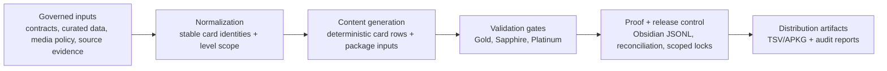
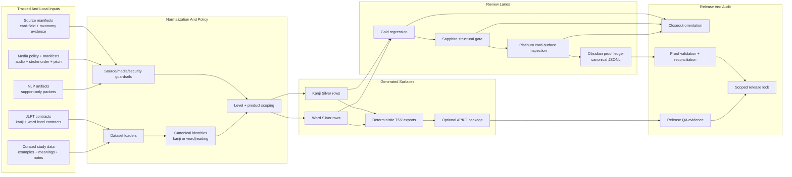
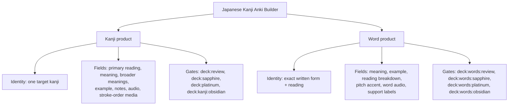
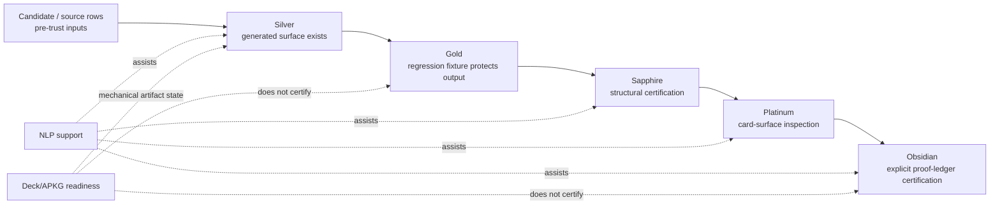
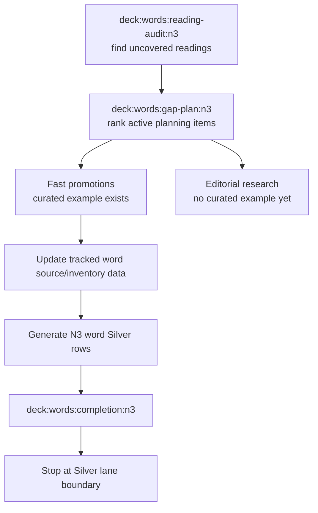
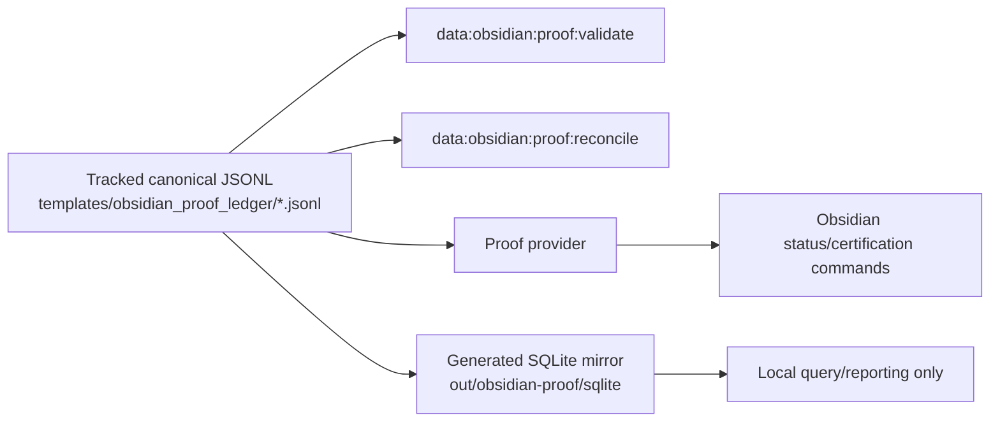

# System Architecture

Japanese Kanji Anki Builder is a governed data pipeline and release-controlled content generation system. Anki cards are the distribution artifact; the architecture is the input normalization, policy enforcement, deterministic generation, lane gating, proof storage, and scoped release process around them.

This document maps how the system turns governed inputs into deck exports, review gates, proof ledgers, and release artifacts. It is a technical orientation, not a certification source. Live commands and tracked contracts own current truth.

## System Identity



## Architecture Summary



## Product Surfaces



Kanji and word products can share source material, generated media, and infrastructure. They do not share certification authority. Each card identity must pass its own lane sequence.

## Lane Model



Rules:

- Every forward lane consumes the lane below it as a precondition.
- A missing downstream lane is expected backlog, not proof that the generated card is bad.
- NLP support can surface risks, prioritize review, and generate packets; it cannot certify cards or write tracked templates.
- Package readiness proves artifact mechanics, not content trust.

## Current Verified State

Verified on branch `codex/n3-word-expansion-preflight` at commit `a7c599ba`.

| Product | Level | Silver | Gold | Sapphire | Platinum | Obsidian |
| --- | --- | ---: | ---: | ---: | ---: | ---: |
| Kanji | N5 | 80/80 | 80/80 | 80/80 | 80/80 | 80/80 |
| Word | N5 | 287/287 | 287/287 | 287/287 | 287/287 | 287/287 |
| Kanji | N4 | 212/212 | 212/212 | 212/212 | 212/212 | 212/212 |
| Word | N4 | 700/700 | 700/700 | 700/700 | 700/700 | 700/700 |
| Kanji | N3 | 341/341 | 341/341 | 341/341 | 341/341 | 341/341 |
| Word | N3 | 269/269 | 8/269 | 8/269 | 8/269 | 0/269 |
| Kanji | N2 | 349/349 | 349/349 | 349/349 | 349/349 | 349/349 |
| Word | N2 | 28/28 | 0/28 | 0/28 | 0/28 | 0/28 |
| Kanji | N1 | 1230/1230 | 1230/1230 | 328/1230 | 328/1230 | 0/1230 |
| Word | N1 | 26/26 | 0/26 | 0/26 | 0/26 | 0/26 |

Obsidian counts for completed scopes are verified by fail-closed certification gates:

- Kanji N5-N2: `982/982` Obsidian certified.
- Word N5-N4: `987/987` Obsidian certified.
- Proof ledger validation: `1969` events across 6 JSONL files.
- N3 word Obsidian is fail-closed: `0/269` certified, `8` Platinum entries need proof, and `261` generated rows are blocked by missing Platinum.
- N1 kanji Obsidian is fail-closed: `0/1230` certified, `328` Platinum entries need proof, and `902` generated rows are blocked by missing current-standard structural entries.

## Word N3 Silver Expansion Path

N3 word is the next active lane, and the lane is Silver only.



Current N3 word facts:

- Canonical inventory rows: `269`.
- Built starter-eligible rows: `269/269`.
- Gold/Sapphire/Platinum: `8/269`.
- Reading coverage: `19.9%` (`236/1184`).
- Active planning items: `932`.
- Fast promotions: `215`.
- Editorial research items: `717`.

Silver expansion should promote curated-example candidates into the generated N3 word surface. It should not add Gold, Sapphire, Platinum, or Obsidian work in the same batch.

## Proof And Query Storage



The JSONL proof ledger is canonical. SQLite is useful for local inspection and reporting, but it is generated output and must not become source truth without a deliberate migration.

## Validation Layers

| Layer | Examples | Authority boundary |
| --- | --- | --- |
| Dataset normalization | `src/datasets/*`, starter data, level contracts | Produces normalized inputs; does not certify review lanes. |
| Generated deck checks | `deck:ready`, `deck:words:completion`, TSV/APKG package checks | Proves generated artifact mechanics and field presence. |
| Review gates | `deck:review:*`, `deck:sapphire:*`, `deck:platinum:*` | Proves only the named lane for the exact card identity. |
| Proof ledger | `data:obsidian:proof:validate`, `data:obsidian:proof:reconcile` | Proves proof structure and binding, not package QA or source taxonomy completion. |
| NLP governance | `nlp:governance-gate` | Proves assistive artifacts are healthy; does not certify cards. |
| Release lock | `docs/releases/v0.2.0-scoped-obsidian-lock.md` | Freezes one scoped release state; future work belongs to the next version. |

## Verification Commands

Use these commands to refresh this architecture snapshot:

```bash
git status --short --branch
git log -1 --oneline --decorate
git ls-remote --heads origin
npm run deck:closeout -- --levels=5,4,3,2,1
npm run deck:kanji:obsidian:certify-status -- --levels=5,4,3,2
npm run deck:words:obsidian:certify-status -- --levels=5,4
npm run data:obsidian:proof:validate
npm run deck:words:completion:n3
npm run nlp:governance-gate
npm run deck:words:obsidian:rereview-status -- --levels=3
npm run deck:kanji:obsidian:rereview-status -- --levels=1
```

If any command changes a count or status, update this document from the live output or remove the stale claim.
