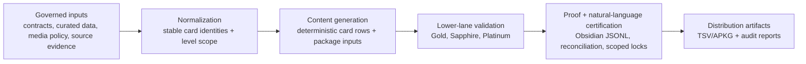
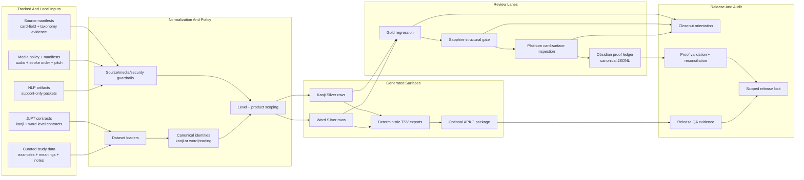
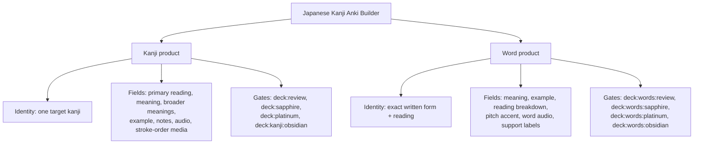
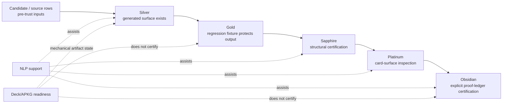
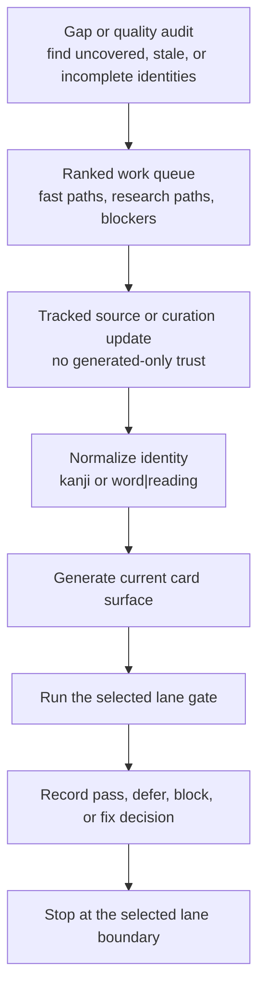
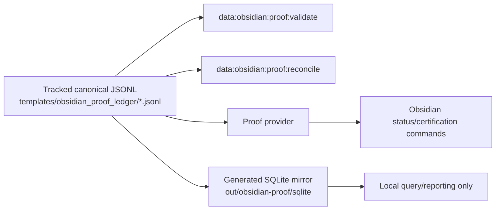

# System Architecture

Japanese Kanji Anki Builder is a governed data pipeline and release-controlled content generation system. Anki cards are the distribution artifact; the architecture is the input normalization, policy enforcement, deterministic generation, lane gating, proof storage, and scoped release process around them.

This document maps how the system turns governed inputs into deck exports, review gates, proof ledgers, and release artifacts. It is a technical orientation, not a certification source. Live commands and tracked contracts own current truth.

## System Identity



## Architecture Summary



## Product Surfaces



Kanji and word products can share source material, generated media, and infrastructure. They do not share certification authority. Each card identity must pass its own lane sequence.

## Lane Model



Rules:

- Every forward lane consumes the lane below it as a precondition.
- A missing downstream lane is expected backlog, not proof that the generated card is bad.
- NLP support can surface risks, prioritize review, and generate packets; it cannot certify cards or write tracked templates.
- Package readiness proves artifact mechanics, not content trust.

## Scale Snapshot

The architecture is product- and level-agnostic. The current repo snapshot proves the same machinery across completed release scope and unfinished visible backlog:

| Product surface | Generated denominator | Obsidian-certified denominator | Boundary |
| --- | ---: | ---: | --- |
| Core kanji | 2212 | 982 | The scoped release lock covers the completed N5-N2 denominator. Remaining generated rows are not Obsidian-certified. |
| Words | 2506 | 1008 | The scoped release lock covers the 308-row N5 and 700-row N4 Obsidian-certified subsets. Current N5 Gold-only rows and N4 word v2 Silver additions are generated-ready but not Obsidian-certified. |

Obsidian counts for completed scopes are verified by fail-closed certification gates:

- Kanji locked scope: `982/982` Obsidian certified.
- Word locked scope: `1008/1308` Obsidian certified for current N5/N4 generated rows; the 281 current N5 Gold rows and 19 current N4 word v2 Silver additions are not Obsidian-certified.
- Proof ledger validation: `1990` events across 6 JSONL files.

## Expansion Workflow Pattern

This pattern applies to whichever product, level, and lane is deliberately selected. The architecture does not make that selection for the reviewer.



The same pattern handles expansion, structural review, card-surface inspection, and proof work, but the lane authority changes. Silver can add generated rows. Gold can protect regression expectations. Sapphire can certify structure. Platinum can inspect the card surface. Obsidian can record proof only after the required upstream lanes exist for the exact card identity.

## Proof And Query Storage



The JSONL proof ledger is canonical. SQLite is useful for local inspection and reporting, but it is generated output and must not become source truth without a deliberate migration.

## Validation Layers

| Layer | Examples | Authority boundary |
| --- | --- | --- |
| Dataset normalization | `src/datasets/*`, starter data, level contracts | Produces normalized inputs; does not certify review lanes. |
| Generated deck checks | `deck:ready`, `deck:words:completion`, TSV/APKG package checks | Proves generated artifact mechanics and field presence. |
| Review gates | `deck:review:*`, `deck:sapphire:*`, `deck:platinum:*` | Proves only the named lane for the exact card identity. |
| Proof ledger | `data:obsidian:proof:validate`, `data:obsidian:proof:reconcile` | Proves proof structure and binding, not package QA or source taxonomy completion. |
| NLP governance | `nlp:governance-gate` | Proves assistive artifacts are healthy; does not certify cards. |
| Release lock | `docs/releases/v0.2.0-scoped-obsidian-lock.md` | Freezes one scoped release state; future work belongs to the next version. |

## Verification Commands

Use these commands to refresh this architecture snapshot:

```bash
git status --short --branch
git log -1 --oneline --decorate
git ls-remote --heads origin
npm run deck:closeout -- --levels=5,4,3,2,1
npm run deck:kanji:obsidian:certify-status -- --levels=5,4,3,2
npm run deck:words:obsidian:certify-status -- --levels=5,4
npm run data:obsidian:proof:validate
npm run nlp:governance-gate
```

If any command changes a count or status, update this document from the live output or remove the stale claim.
